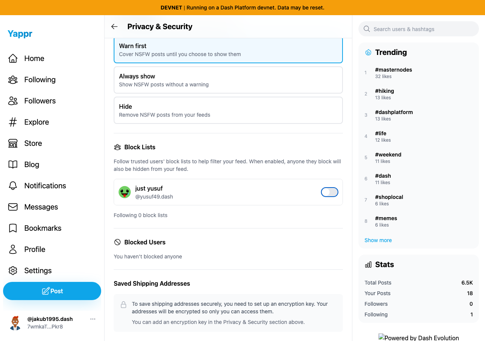
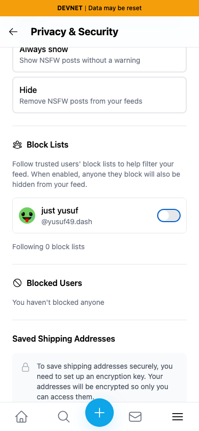
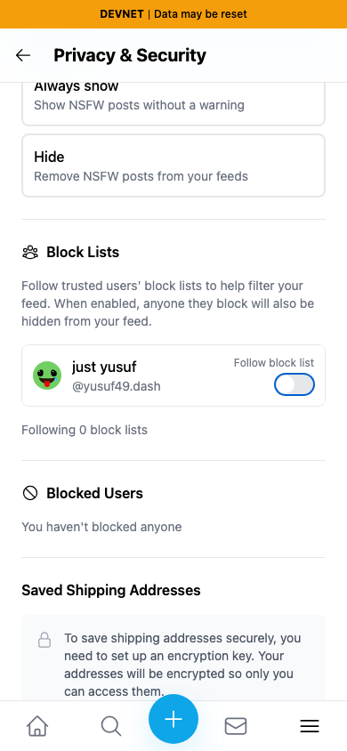

# Trusted block-list switch labels

| Surface | Before — exact base | After — full PR head | Shared fixture | Visible delta |
|---|---|---|---|---|
| Privacy & Security / Block Lists |4105c5d1c914f5d0838619da93c3b8d28b4a780e|3935e6975851b94a8f83ffde9b11ac73fbd0f8d0|Persona48 follows49 (4SFrGiHwDXKgcrDquF5wvFQ9oaWUGfqm8W4Wk4Qy6JBs), trust off|Visible Follow block list label above switch; programmatic name includes account|

Actual independent production builds against live devnet, disposable seeded auth sessions, light theme. Same account/list on desktop 1280×900 and mobile 390×844. No API or DOM content mocked.

| Before — exact base | After — full PR head |
|---|---|
|  |  |
|  |  |

Before, the switch accessible name is empty. After, it is Follow block list from @yusuf49.dash. The visible label toggles the real setting. A fresh browser context reads trust on; Space toggles it off and another fresh context confirms off. The temporary follow was removed. Mobile has no horizontal overflow. JSON assertions supplement the visual label comparison.

All five PNGs inspected at original resolution. Lint, TypeScript, committed-head devnet build, and independent source review passed. Initial local build lacked the vendor library output; rebuilding with the unchanged, built vendor dependency passed. Footer logo omission is a local base-path server artifact. The earlier functional trusted-list cycle is published separately; no backend defect is claimed.
