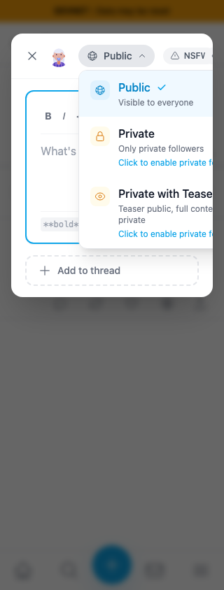
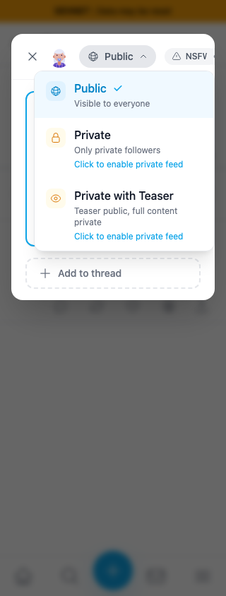

# Keep the composer visibility menu in view

Exact staging `cf0efbc10b8757137063113ebbd2061e8b87d8f7` → full signed head `45829cea52d95b338f1bf6112b97b369648d0c4c`, separate committed devnet builds. Persona55 fresh scoped sessions, existing background post `9mcdDNznWP86bScjmMykF1kzNpecneoFoZVVNAB5qCFd`, light theme. Open composer, resize to320×844, open Public. No post/key/feed/request writes. Seeded sessions are not login evidence.

| Before — exact staging base | After — full fix head |
|---|---|
|  |  |

The inline menu reaches x368 and clips at the dialog edge. The portaled popup shifts to x48–304; all option labels and descriptions are visible. Header/formatting-toolbar clipping visible outside the popup is covered separately by QA110/QA120.

Compatibility views: [390px](after/390.png), [1280px](after/1280.png), [844×390 short viewport](after/landscape-scroll.png). The short-viewport popup uses available height and vertical scrolling. The last state uses persona39's existing enabled private feed, without submitting anything.

JSON assertions cover all Public/Private/Private with Teaser selections with keyboard at320×844,390×844,844×390; no-follower warning; unavailable-private prerequisite prompt and dismissal preserving Public; trigger focus after selection/Escape; Escape dismissing only the popup; trigger toggle; outside click inside the composer. Pointer Public selection also passes. Bounds and option-edge hit tests show visible options, beyond mere outer dialog fit. The before390 ledger follows the320 case and records the old overflow container's horizontal scroll; it is not used as a primary image comparison.

All five published PNGs inspected at original resolution. Production devnet build including lint/typecheck;265 unit tests; independent review approved both portal/collision and short-height changes. PLAN.md and JSON retain exact provenance.
