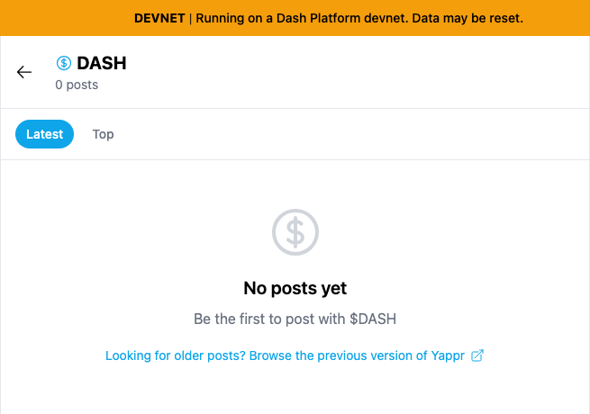
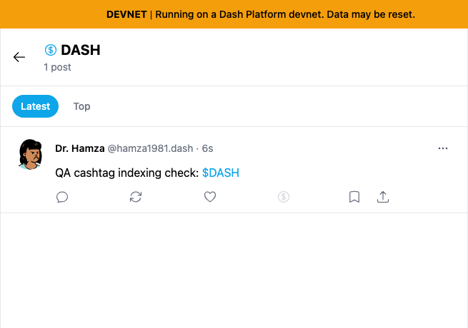
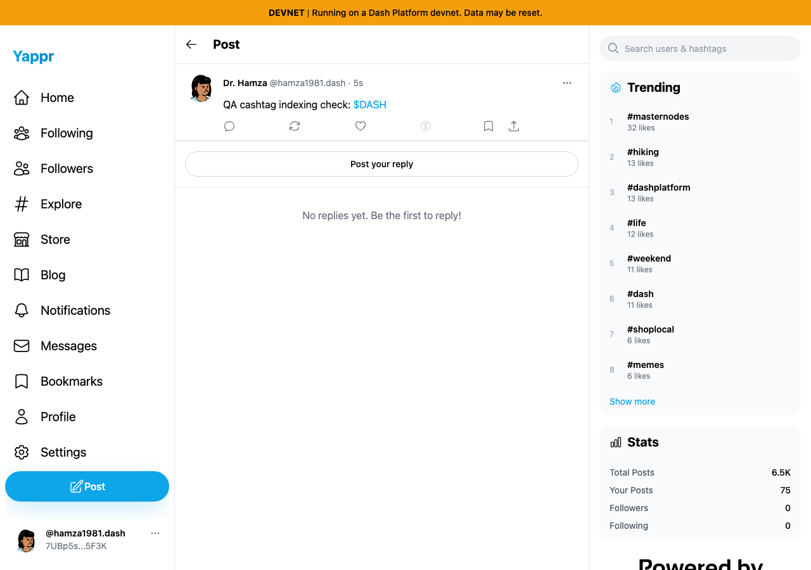

# QA144 — inline cashtag indexing

Before exact base: `cf0efbc10b8757137063113ebbd2061e8b87d8f7` (build ID `cf0efbc1`). After full PR head: `3665c8862e930a8b6b6fc14d03f6f67cf096b632` (build ID `3665c886`). Separate production devnet builds; real Moutai reads and ordinary UI writes. The unchanged static export adapter served the baseline on 3288 and the fix on 3374.

Creating `QA cashtag indexing check: $DASH` previously succeeded, but clicking its `$DASH` link opened an empty page: the inline post had no hashtag field. The fix stores `dash_cashtag`, so the new post appears on that page.

| Before — exact base | After — full PR head |
|---|---|
|  |  |

These focused views are unaltered crops of the same coordinates `(275, 0, 655, 460)` in the 1280×900 captures. Original full-resolution pages: [before](before/cashtag-result.png), [after](after/cashtag-result.png).

The corresponding successfully published post, before following the link:

| Before — exact base | After — full PR head |
|---|---|
|  |  |

Shared persona: Dr. Hamza / `hamza1981.dash`, identity `7UBp5sw8GBwMriinMNyKGV9nPHsCfxovgCNwRBjY5F3K`. Same post text, Chromium 1280×900, light theme, default browser locale/timezone (not overridden), and separate browser contexts on the same host. A private helper restored this scoped test account's existing session; this is not sign-in ceremony evidence. No DOM/network-response replacement or artificial product data was used.

Creation is the behavior under test, so the two ordinary posts necessarily have different IDs and timestamps. The before screenshot was taken before the after post existed. The sidebar's own-post count changes from 75 to 76 because both posts were temporarily retained:

- Before: `GGLWFjSveCfigSfLXjtuzHYS9FNC4S3Fv6ArNpvx7q5A`, created during capture at 2026-09-16T04:50:10Z.
- After: `391MamDebj29ksh3vdShyQ6eG8oKoJeeVefPoAw8Havw`, created during capture at 2026-09-16T04:53:49Z.
- Length-boundary post: `3L5xfB6e5amDsyYVitxMjxUhbj6PZtg3Hs77agjEt6ba`.

[Independent public SDK readback](platform-before-cleanup.json) shows the before post's absent hashtag, the after post's `dash_cashtag`, and the long symbol's 61-character stored tag. All three temporary posts were then deleted through the UI and independently confirmed tombstoned: [UI cleanup](cleanup-ui.json), [SDK cleanup](platform-after-cleanup.json). Persona 73's temporary like was removed and fresh browser readback confirmed unliked; no follow relationships changed.

Validation: 14 helper tests, targeted ESLint, TypeScript, production `build:devnet`, and independent actual-diff review APPROVED. [After UI results](after/result.json) cover actual `$DASH` clickthrough/Latest, like with fresh persistence, Top All time and Today, unlike with fresh persistence, and a 63-character cashtag symbol saving and linking to its 53-character symbol plus 8-character suffix. Tests preserve the existing first-`#hashtag` priority, 61/63-character encoded ceilings, invalid numeric cashtag handling, and unchanged legacy conversion. Only new cashtag-only posts gain an indexed tag; existing untagged posts are not rewritten.

Every full image and focused crop was opened and inspected at original resolution. The images contain only public QA account data and public interface content. [SHA-256 manifest](sha256.json) records all six final image files.
