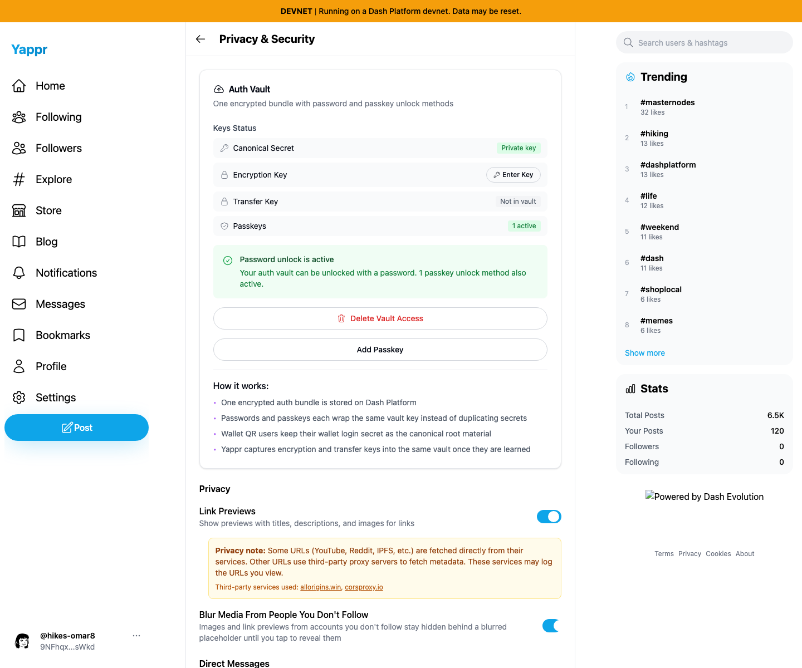
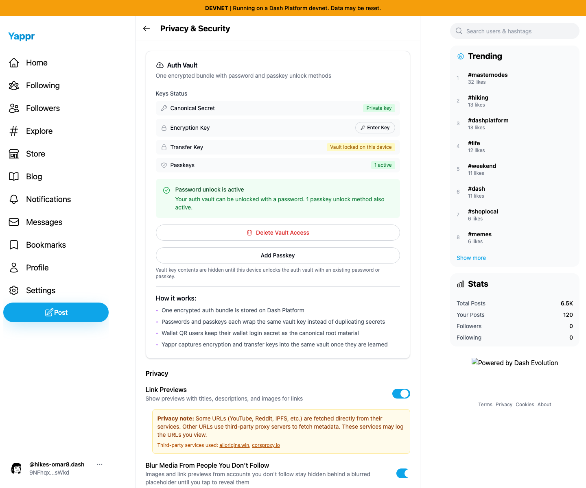
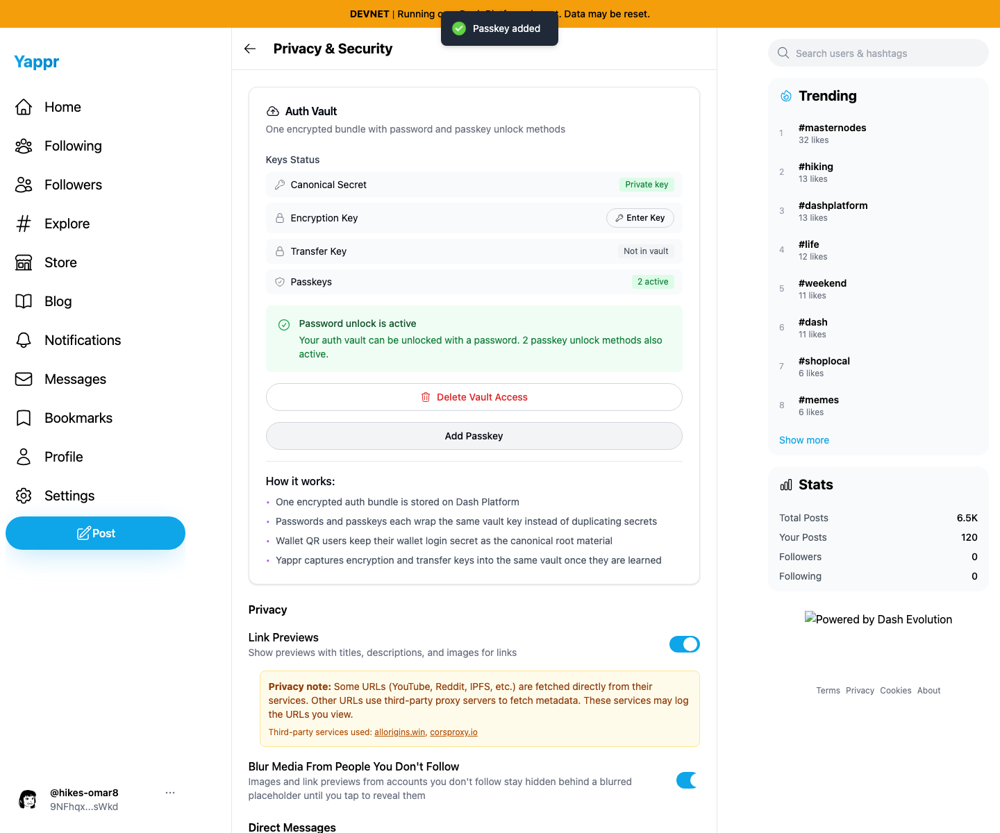

# Current staging Auth Vault recovery checks — persona 39

Exact source `c98a6ecd7e26ae5bc9fc8e400e6011eb8465b3a0`; independently built production devnet export at `http://localhost:3260`. This is same-revision QA evidence, not a before/after fix comparison. Existing synthetic persona 39 `hikes-omar8`, identity `9NFhqxW8upkFMVTE5h5VmYWLdSEJ26B2iMKdhCFgsWkd`. Normal application UI only. Fresh Chromium contexts at 1440×1200, en-US, America/Chicago, light theme. Four screenshots opened and inspected at original resolution; no credentials or private browser/authenticator state published.

Passed: one incorrect password rejected visibly; correct existing password restores the same identity and unlocked vault; reload retains session and unlocked vault; normal logout clears signed-in navigation. Fresh WIF sign-in restores identity with the local vault locked; reload retains that state; logout/password sign-in recovers the unlocked vault.

A fresh second QA passkey was enrolled through Settings Add Passkey after password sign-in. With that same live virtual authenticator, normal logout and the default passkey sign-in button restore the same identity and unlocked vault; reload retains both; normal logout clears signed-in navigation.

Equipment: standard Chromium virtual CTAP2.1 resident PRF authenticator with user verification. The original exported virtual credential lacked portable PRF state and returned “This passkey/provider did not return PRF output” on both original staging `4105c5d1` and current `c98a6ecd`. The successful fresh ceremony above used one live authenticator. This is not a physical-device, cross-browser, exported-PRF portability, or yap.pr relying-party claim. Neither the equipment limitation nor an initial automation timeout is classified as a product regression.

No new confirmed issue. Delete Vault Access was not exercised because this established QA vault was preserved. Password/key captures precede the second enrollment and therefore show one passkey; enrollment/restoration captures correctly show two. [Machine-readable checks](results.json).

## SHA-256

- `521c2d1ba45d885bfffbfcbdbbdd50655bf82caea1b378f81b8930e080dc5192` — `fresh-passkey-enrolled.png`
- `3db54183780fd35e674b60787adbdf92800cbced330417fe340fd4dd6f0d93e9` — `fresh-passkey-unlocked.png`
- `10640b2a59ea811efa1c258c299a7d8b28235980dfc74bec58681ab24cecacec` — `key-login-vault-status.png`
- `737f9b265bdeae047e850d6f87fe00fac698a6ae74500e195b805446e8a8a176` — `password-unlocked.png`
- `2fadb46ed468879e8f1930e3f89e8b1c3d0441443c9ec28c3b74b23f2d4cf3fc` — `results.json`
