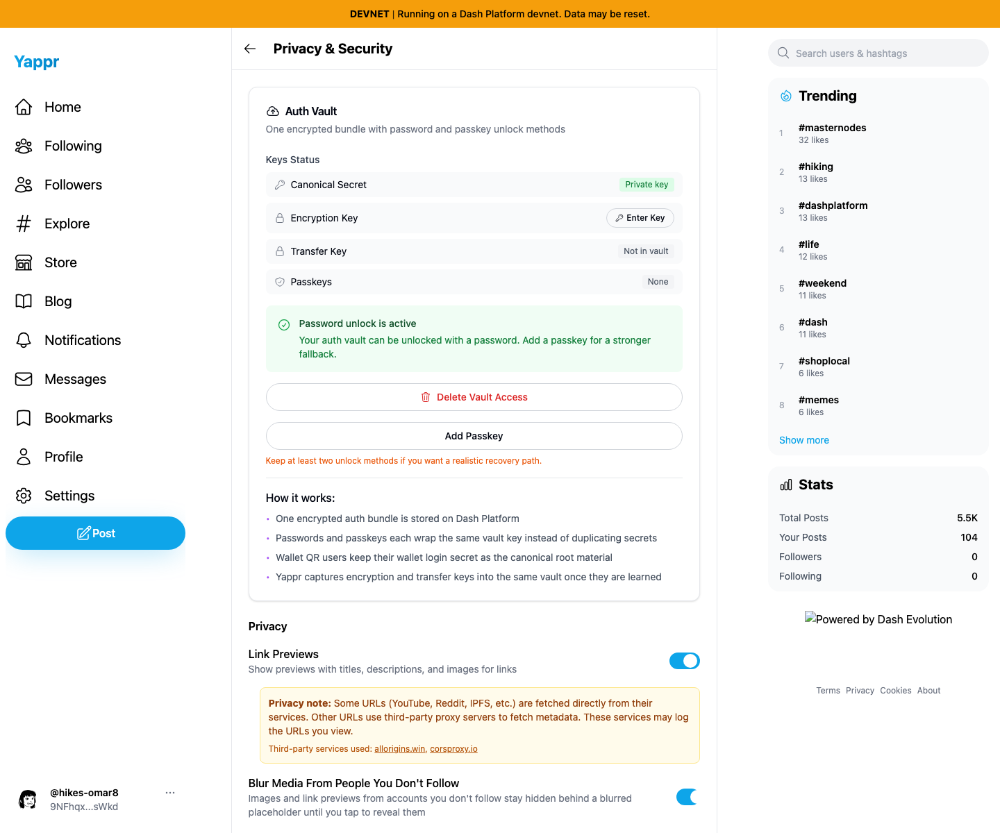
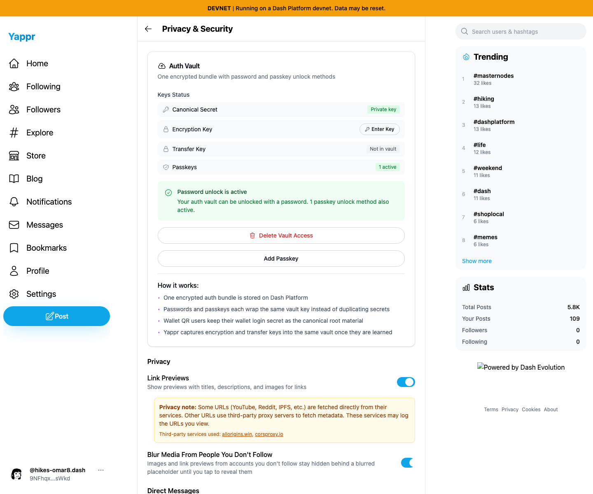

# Auth Vault normal-flow QA — persona 39

Tested exact staging `4105c5d1c914f5d0838619da93c3b8d28b4a780e` on its independently built production devnet export at `http://localhost:3211/devnet`, against real devnet data, 2026-09-15.

Account: **hikes-omar8**, identity **9NFhqxW8upkFMVTE5h5VmYWLdSEJ26B2iMKdhCFgsWkd**.

| Flow | Result | Screenshot |
| --- | --- | --- |
| Normal WIF sign-in and password enrollment | PASS — actual advanced sign-in inputs, automatic Protect Your Auth Vault dialog, generated passphrase + consent, Backup to Chain | [Empty enrollment](password-enrollment-empty.png) |
| Enrollment persisted | PASS — Settings → Privacy & Security says Password unlock is active | [Status](password-enrolled-settings.png) |
| Logout → password sign-in | PASS — normal account-menu logout, username/password UI, same full identity profile URL | [Restored](password-after-logout-signin.png) |
| Fresh empty browser context → password sign-in → reload | PASS — same assigned identity and active password status after reload | [Fresh context](password-fresh-browser-reload.png) |
| Add Passkey from Settings | PASS — success toast, 1 active, password + passkey status | [Enrollment](passkey-enrolled-settings.png) |
| Logout → default Sign in with a passkey | PASS — discoverable standard browser ceremony restored assigned identity without username/password entry | [Restored](passkey-after-logout-signin.png) |
| Reload restored passkey session | PASS — same profile URL and both active methods | [Reload](passkey-restored-reload.png) |

| Password recovery in a fresh context | Passkey session after reload |
| --- | --- |
|  |  |

Virtual authenticator: Chromium CTAP2.1, internal transport, resident credential, user verification, automatic presence simulation, PRF. This tests the normal WebAuthn API ceremony using standard browser test equipment; it does not claim physical-device or cross-browser portability. RP origin is localhost for this staging build, not yap.pr. No auth-state injection or authentication bypass. No other identities were accessed.

All seven final images were opened and visually inspected at original resolution. Credentials were never revealed in screenshots or public results. Secret fixtures are maintained separately in a private local directory and must not be published. Local source worktree remained unchanged; no PR needed for the passing flows.

Incidental UI observation for independent validation: the sidebar shows `@hikes-omar8` after password sign-in and `@hikes-omar8.dash` after passkey sign-in. Both profile links resolve to the same full identity. Right-hand global statistics change between captures because the devnet seeding run is active; this is not part of the auth comparison. The static Dash Evolution footer image is broken in this local baseline and is not evidence of an auth issue.
