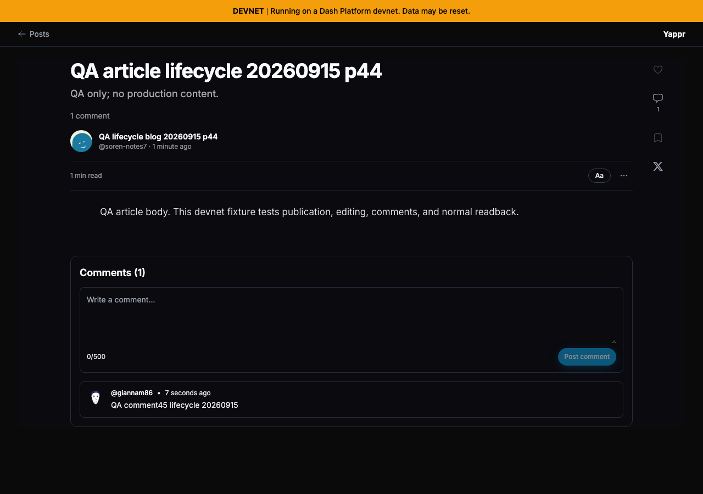
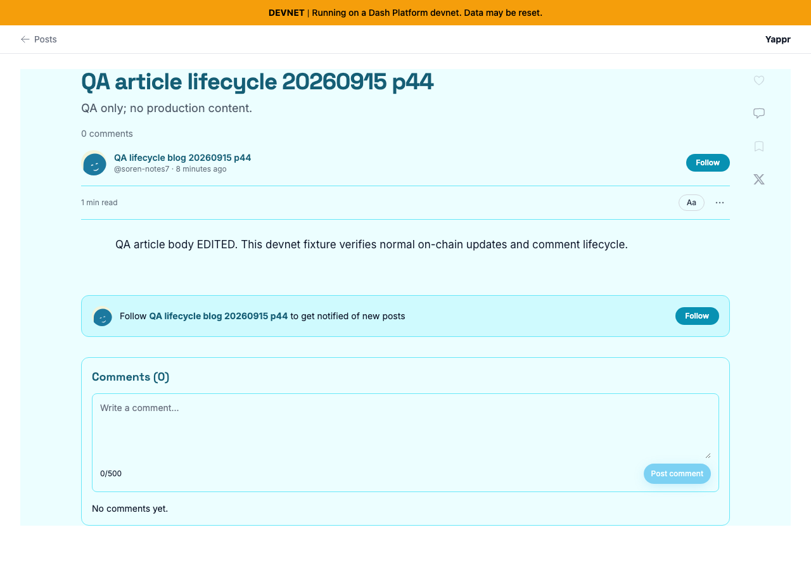

# Blog lifecycle QA — personas44/45

Actual production build4105c5d1c914f5d0838619da93c3b8d28b4a780e connected to devnet. QA sessions were seeded privately; this package does not test login. Desktop1280×900. These are sequential lifecycle observations, not before/after implementation comparisons.

Blog `GZkg15HyWHb3L4QjcnE6xU2AqkPBtxSYhC76qVHSu1rz`, article `qa-article-lifecycle-20260915-p44`, owner44 `4WJqx5yBKTW3v6FbkvwNZpGvWyafDzTjMSZLZEYwtC8R`, commenter45 `giannam86`.

Passed through ordinary UI with fresh independent browser readbacks:

- Create blog, My Blogs discovery; description update and label creation.
- Publish article; another account reads it. Edit body and freshly read the persisted result.
- Save Ocean theme; fresh reader and fresh theme editor both show background#ecfeff.
- Local draft title and body restore after full reload in disposable context.
- Persona45 comments; fresh owner44 reads it. Persona45 deletes own comment; fresh read shows completed empty state. Additional reproduction comments were also deleted.

No article deletion action is exposed in this normal UI; no unsupported deletion was attempted. Initial incorrect empty-state selector was corrected, not reported as product failure.

This earlier lifecycle step uses the original article body and original theme.

This later fresh viewer read shows the saved edit, new Ocean theme and verified deleted comments. Both images inspected at original resolution. Draft restoration was asserted programmatically; its low-contrast title is not presented as useful visual proof.

Confirmed issues: light-mode authoring contrast, fixed in[#427](https://github.com/PastaPastaPasta/yappr/pull/427); stale count after own deletion, fixed in[#429](https://github.com/PastaPastaPasta/yappr/pull/429). Each PR has its own exact base/head comparison.
