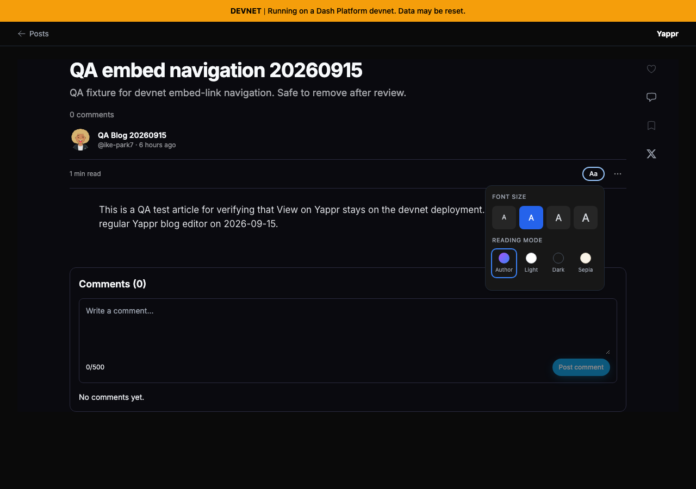
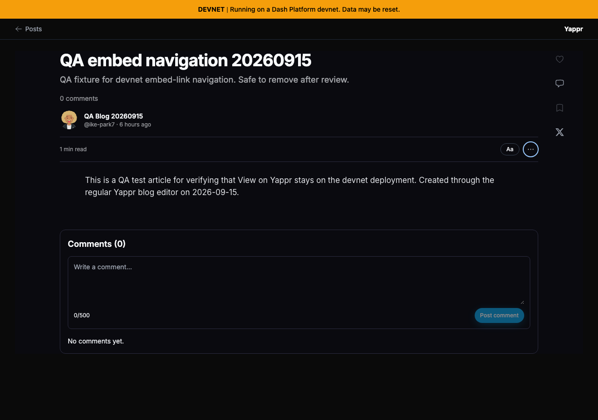

# Reader and embed QA — B04, B17, B23, B24

Tested frozen production **cf0efbc10b8757137063113ebbd2061e8b87d8f7** at `http://127.0.0.1:3288/devnet`, served directly from that worktree's output. Guest Chromium and seeded, read-only persona65 `9cjhprZAFUDVG71Fo8b5eCzHpwjo9Aj9npcRRpmCJBbw`; seeded authentication is not login-ceremony evidence. No comments, follows, quotes, edits, or provider writes were performed.

## Fixtures

- Ordinary article: blog `BkqjYQ95Mm2vNGEaoKbE473jodp7ZPFQr1Mj3jmqw6wA`, post `5cY37VaxiKxBnprHfXG11Nx37eDv6Jb8RHYDMCmWWi8G`, owner `H4P7NB1JNJ3B9LRpPixi3sUs7qhN5w9xs9YbQSBFh8Z1`, slug `qa-embed-navigation-20260915`.
- Second article for history navigation: blog `GZkg15HyWHb3L4QjcnE6xU2AqkPBtxSYhC76qVHSu1rz`, slug `qa-article-lifecycle-20260915-p44`.
- Rich article, created through ordinary UI by the parent QA agent: blog `BdMQRKM6xT8jx4bKbkhP3wYo7V835pDjcEWTbN5PMNRU`, post `66syyLM2ZAakx2JNZuMJw4PY896cphx8Q2vc1kVCNTK`, owner `CNARhSLcQRfdxLZXTrvDVtVGKg1RHXjwJTpGSd2DXLGw`, slug `qa-comprehensive-article-20260915-p64`.

## Results

| Branch | Result and evidence |
|---|---|
| B17 four sizes | Pass: settled body sizes small14px, author-medium17px, large18px, xlarge20px. Reset returns Author/medium. Initial assumptions of16px medium and immediate transition samples were rejected; `reader-refined.json` and canonical `results.json` are authoritative. |
| B17 four modes/persistence | Author/Light/Dark/Sepia update palette and app chrome. Sepia+xlarge survive guest reload; Sepia+large survive persona65 reload. |
| B17 keyboard | **QA96 confirmed:** focus Reading preferences → Enter opens popover but leaves focus on trigger; Tab moves to More actions and closes popover without reaching any option. Pair below. Escape itself returns focus correctly. |
| B17 mobile | 320x700 and390x700 reader/popover fit horizontally. Article remains vertically scrollable. |
| B17 theme restoration | Preexisting dark theme restores when leaving Light reader normally. Reload in Light then leave remains light: separately reported as a candidate pending intended persistence behavior, not asserted as a confirmed bug here. |
| B23 themes/copy | Light/Dark preview changes and snippets change; actual clipboard exactly equals shown iframe + blank line + script snippets, both guest modes and authenticated Dark. |
| B23 dialog dismissal | Close, Escape with parent-dialog focus, and backdrop return focus to Embed in its still-open menu; second Escape returns to More actions. |
| B23 mobile | **QA95 confirmed:** dialog height772 at320x568 gives Close y-65, Copy y613; height752 at390x667 gives Close y-15.5, Copy bottom692.5. Wheel does not reveal controls. Fix evidence is separate in `pr-embed-dialog-mobile`. |
| B24 route variants | Matching owner, absent owner, dark, unsupported theme→light all render; wrong owner shows mismatch; unknown valid-shaped post shows not found; missing post gives explicit guidance. All error footers preserve/devnet, and clicked recovery opens Blogs.390px layout fits. |
| B24 real hosted script | Controlled separate-origin localhost3356 HTML host loads exact frozen `/devnet/embed.js`. Actual script creates sandboxed dark iframe. Clicking View on Yappr navigates host tab to the correct article in/devnet. Host is disclosed test scaffolding, not product UI. |
| B24 rich content | Heading, bold, bullets, footnote text, callout text, inline URL image render; image naturalWidth1024 and fully visible in inspected screenshots. **Content-loss finding:** code visible in reader (`const qa = "persisted";`) becomes an empty code element; populated simple table and YouTube block disappear. TOC is absent and columns flatten to text. Parent owns issue grouping. **Contrast finding:** light embed's dark text is nearly invisible on default dark Background section gradient. |
| B04 bad links | Nonexistent blog/slug show Blog not found/Post not found; top Blogs/Posts navigation remains available. |
| B04 offline | Ordinary browser offline, blog-home→article click produces Failed to load blog. Reconnect + reload restores actual article. No automatic retry claim. |
| B04 navigation | Article→Posts→Blogs then browser Back twice restores article; navigating to a distinct existing article then Back restores correct first article. |

## Inspected visual evidence

All linked final PNGs were opened at original resolution. These are single-revision QA evidence, not before/after fixes.

| Reading popover opened with keyboard | After one Tab: options dismissed, focus on More actions |
|---|---|
|  |  |

- [Sepia/xlarge reader](reader-sepia-xlarge.png), [320px preferences](reader-mobile-320.png), [390px preferences](reader-mobile-390.png).
- [Actual dark script iframe on disclosed host](host-script-dark.png).
- [Rich embed desktop](rich-embed-desktop.png), [rich embed320px](rich-embed-mobile-320.png): missing code/table and low-contrast Background section; loaded inline image is visible.
- [Missing blog](blog-missing-blog.png), [missing article](blog-missing-slug.png), [ordinary offline navigation](blog-offline-navigation.png).

## Limits

These four assigned groups do not certify all blog stories. External provider upload, rich-block editing, outbound social posting, and wallet flows were outside this read-only task. Only ordinary URLs/content were used. Public fixture contents may be changed later by their owning QA agent; exact observed text and DOM details are retained in `results.json`.
