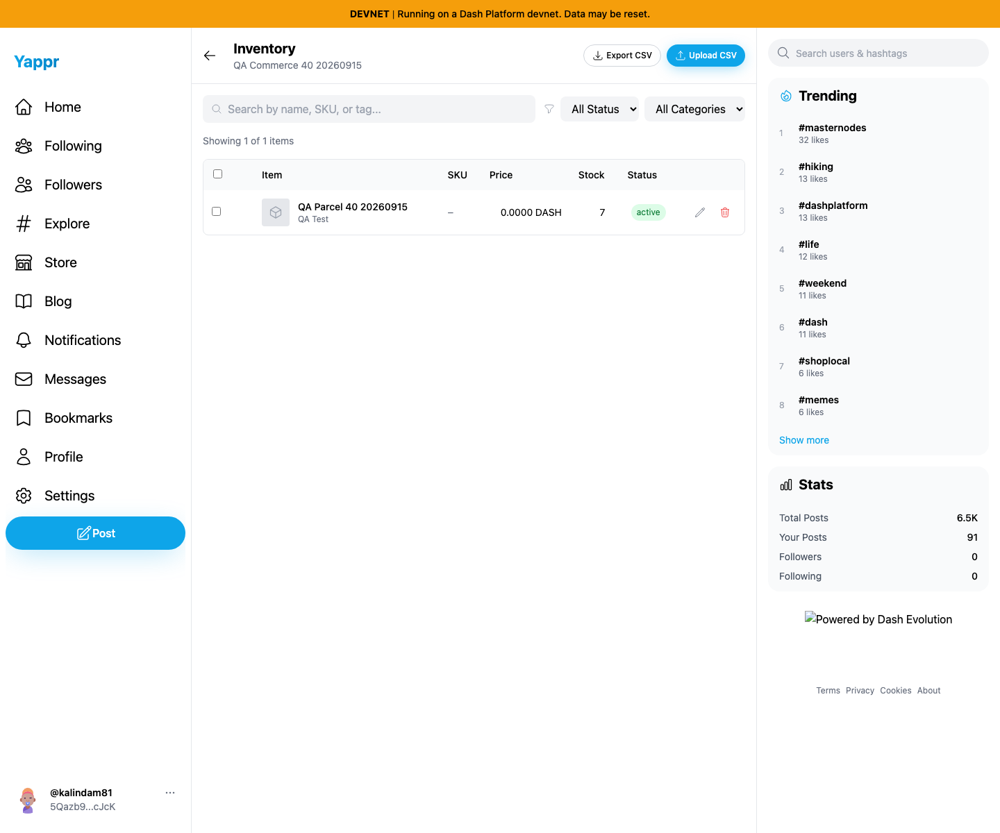
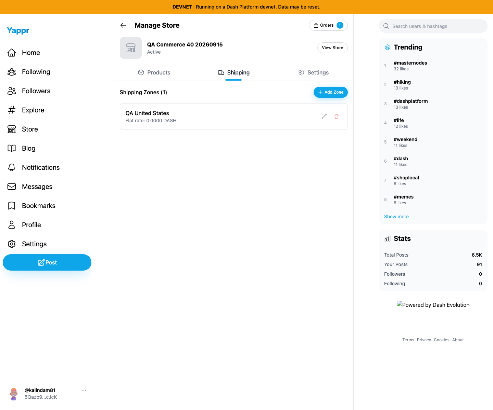
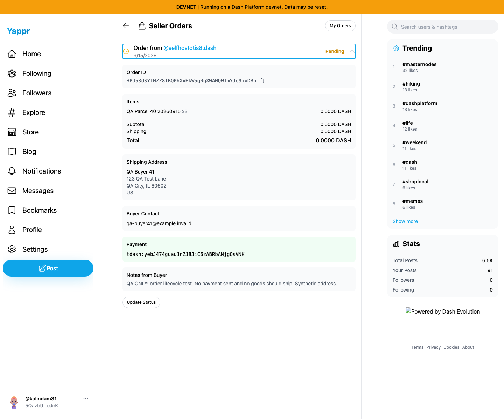
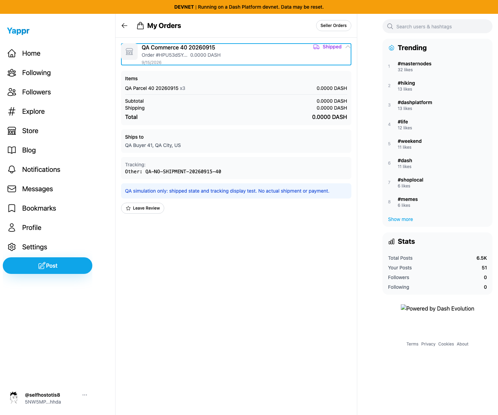
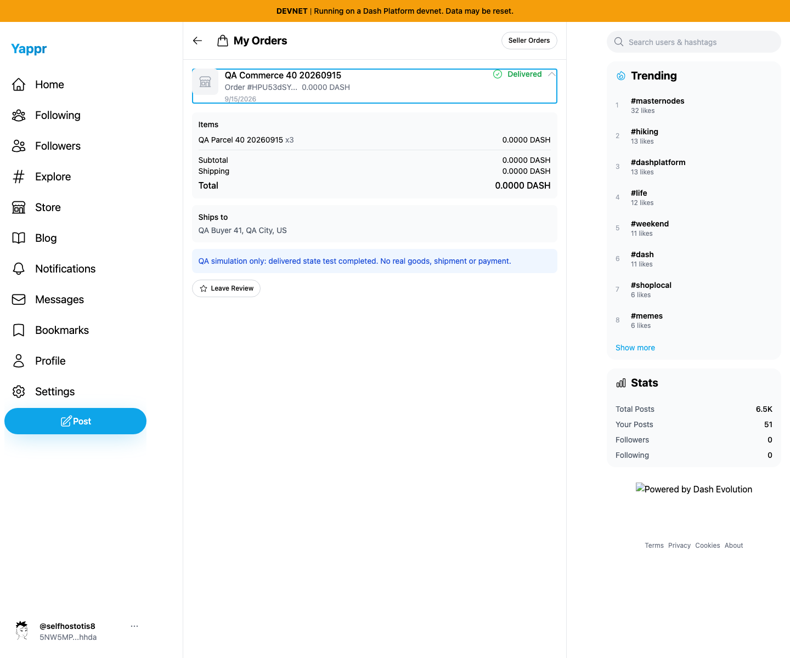
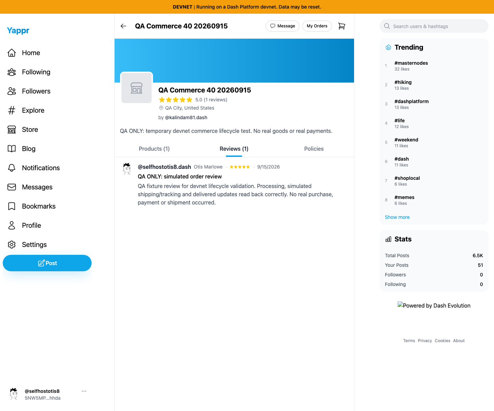
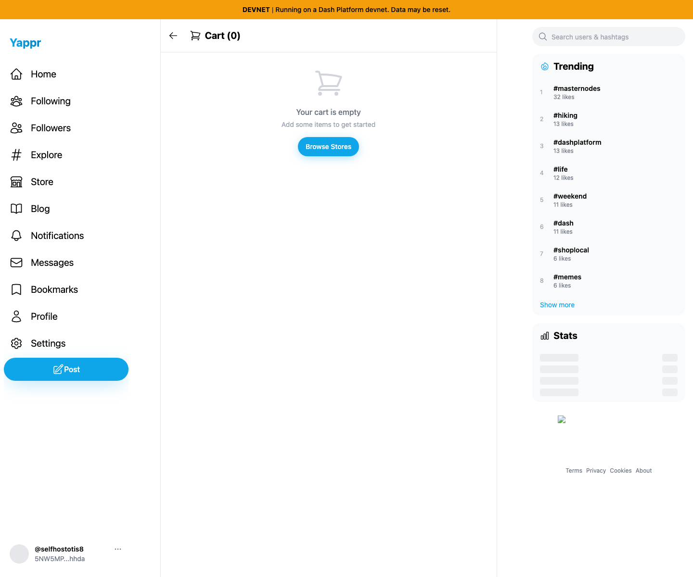

# Devnet commerce lifecycle QA — seller40 / buyer41

Tested September15,2026 using the production devnet export of exact staging baseline `4105c5d1c914f5d0838619da93c3b8d28b4a780e` at localhost:3211, backed by real devnet data. Chromium1440×1200, en-US, America/Chicago, light theme. Normal supported username/private-key login and existing encryption-key entry; no storage injection or mocked responses.

**No blockchain payment was sent and no real shipment occurred.** Store, item, order notes, simulated fulfillment messages and review explicitly identify the QA fixture. This verifies application writes, encryption/decryption, status display and persistence; it does not verify payment settlement, carrier integration, physical fulfillment, or refunds.

## Exact fixtures

- Seller: kalindam81 / `5Qazb9Ncc7LgLSSWkPj36Qpp5ZpEoQEcHNR2Ync7cJcK`.
- Buyer: selfhostotis8 / `5NW5MP2yVzqGavBCZtpfJ72CcGhiN2vX7RsdtJpQhhda`.
- Store: QA Commerce40 20260915 / `98FYBhEF9Q8xNzbamzy66Dm5cMQ5gm9MoAZaiy518sNp`.
- Product: QA Parcel40 20260915 / `25n2uxxtBSAWVWZBD86uGXdkHW7nYP25jpgfpPY87qRH`,100duffs (0.00000100 DASH), initial stock5 edited to7.
- Order: `HPU53dSYTHZZ8TBQPhXxHkW5qRgXWAHQWTmYJe9ivDBp`, quantity3, subtotal300duffs, shipping200duffs, total500duffs.
- Shipping: QA United States, US region,200duffs. Synthetic address/contact only.

## Results

| User story | Result |
| --- | --- |
| Create store, set description/location/DASH default/policy | PASS: persisted through fresh edit readback |
| Configure owned devnet payment address and US shipping zone | PASS: saved/read back |
| Create product and edit inventory stock5→7 | PASS: fresh edit retains exact price, reload retains stock7 |
| Add2 to cart, increase3, reload, decrease2, remove all, reload, re-add3 | PASS: expected quantities and empty state persisted |
| Shipping, policy acceptance and encryption prerequisite | PASS after async shipping calculation completes; premature Continue can falsely reject address |
| Place unpaid QA order and clear cart | PASS: actual order persisted, cart empty after placement |
| Buyer and seller read encrypted order | PASS: item/address/contact/payment/notes decrypted for assigned participants |
| Seller processing→shipped→delivered updates | PASS: each read back by buyer after reload |
| Simulated shipment tracking | PASS: Other carrier and QA-NO-SHIPMENT-20260915-40 visible |
| Buyer review and storefront rating | PASS: review persisted, Leave Review removed, store shows5.0/1review |

## Issues observed

- DASH prices are rounded to4decimals, displaying nonzero item/shipping/order amounts as0.0000 DASH. Fix tracked in Yappr PR426 with exact-base/head comparison.
- Add Product and Add Shipping Zone start USD despite store default DASH.
- Immediate Continue during shipping calculation can report that an accepted US address cannot be shipped to; unchanged address passes after calculation completes.
- DASH order with tdash payment attempts an exchange quote and eventually reports Price unavailable / Amount not calculated; follow-up validation/fix tracked separately.
- Checkout address fields lack associated labels; review stars lack accessible button names/rating state (follow-up observations).

The images below document the exact tested baseline, so they intentionally retain its known DASH display bug. No loss of stored value or actual payment is asserted.

## Screenshots

### inventory stock seven readback

### shipping zone readback

### seller order decrypted

### buyer processing readback

### buyer shipped tracking readback

### buyer delivered readback

### store review readback

### cart cleared after order

