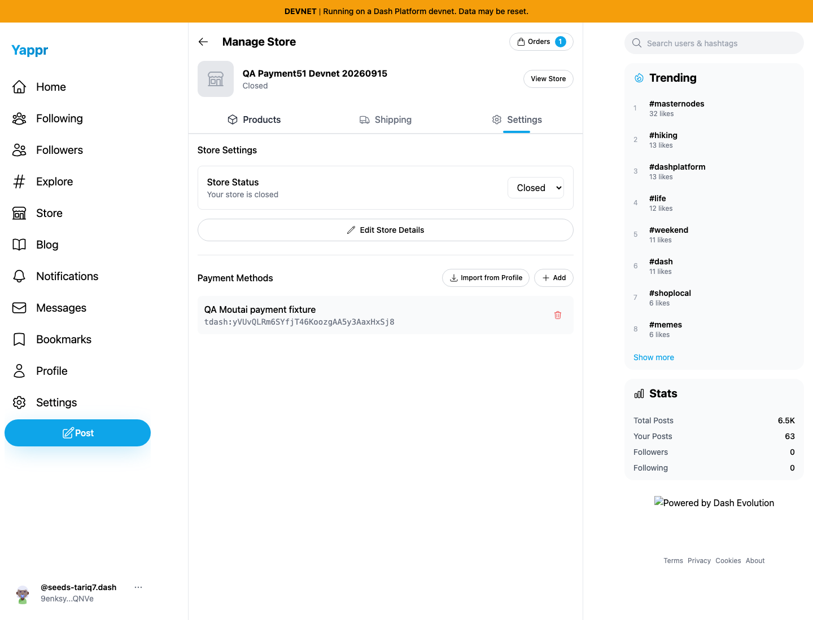

# Isolated commerce fixture cleanup

After the actual payment and exact base/head screenshots were complete, the dedicated merchant persona51 closed only store `GJdJn1iWx9CdtqRXetwa39Kkr3ZG2fBajQbcE1u6aJKr` through the ordinary Store Settings selector on clean staging `c98a6ecd7e26ae5bc9fc8e400e6011eb8465b3a0` (local exact-build port 3260). A fresh UI reload confirms Closed; an independent SDK query confirms the persisted store status and continued existence of paid order `2T8ThBeiKHy7ajPLe1bzjGgyN9RudXZXhaQ1byNZS7uZ`.

The screenshot was inspected at original resolution. No order cancellation or refund was performed. The actual payment, paid order, and product remain available for reproducibility. Payer/payee are dedicated QA wallets; no personal wallet or shared merchant fixture was changed.

[Original real-payment report](../commerce-payment51/README.md). Its initial active-store screenshots retain their original immutable provenance; this addendum records the later cleanup state.
