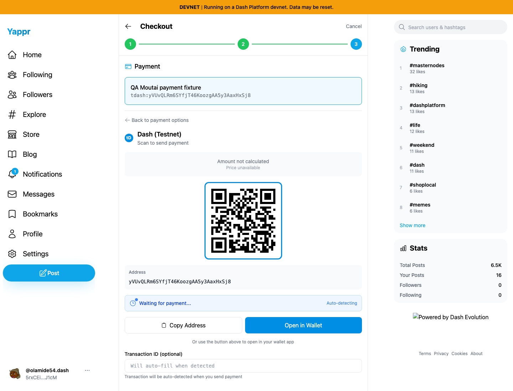
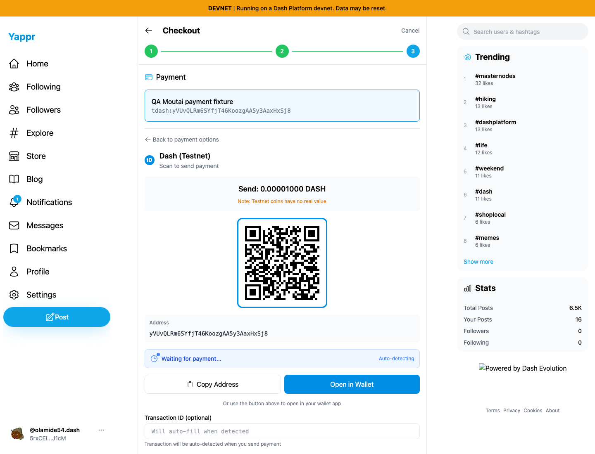
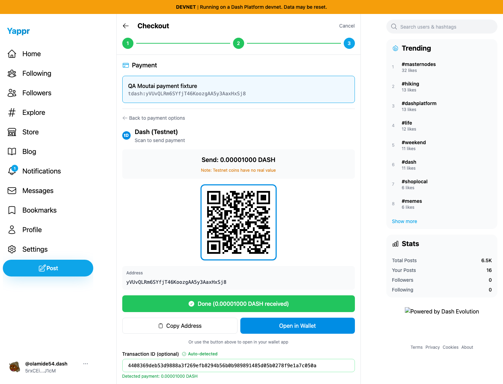
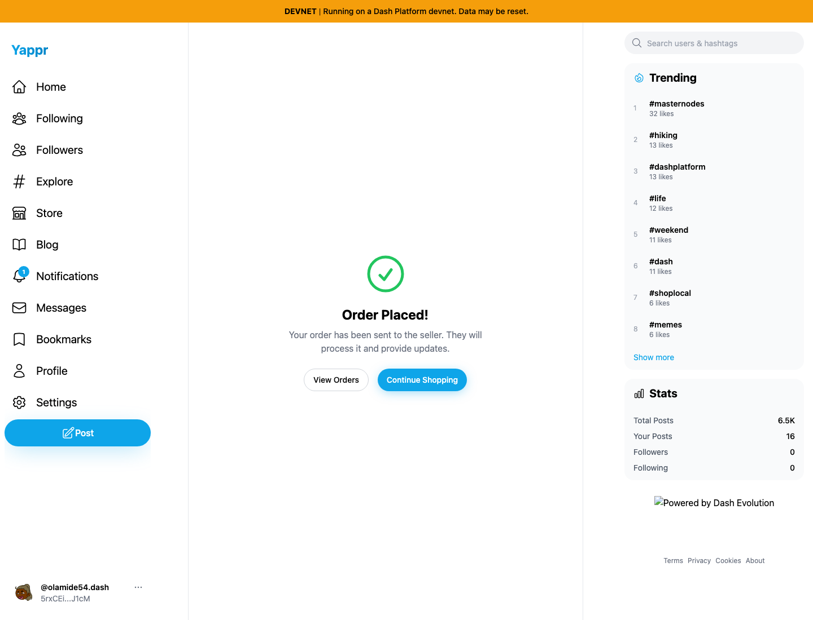
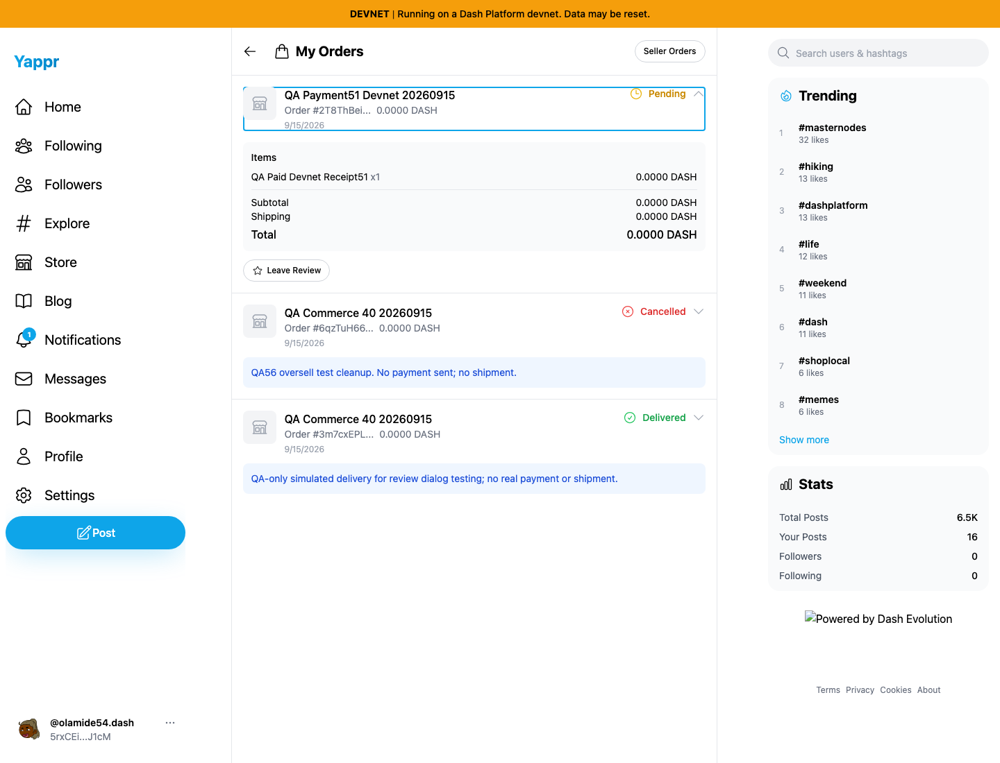
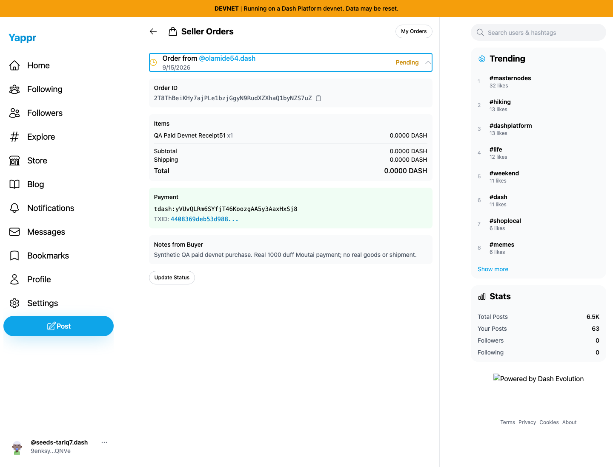
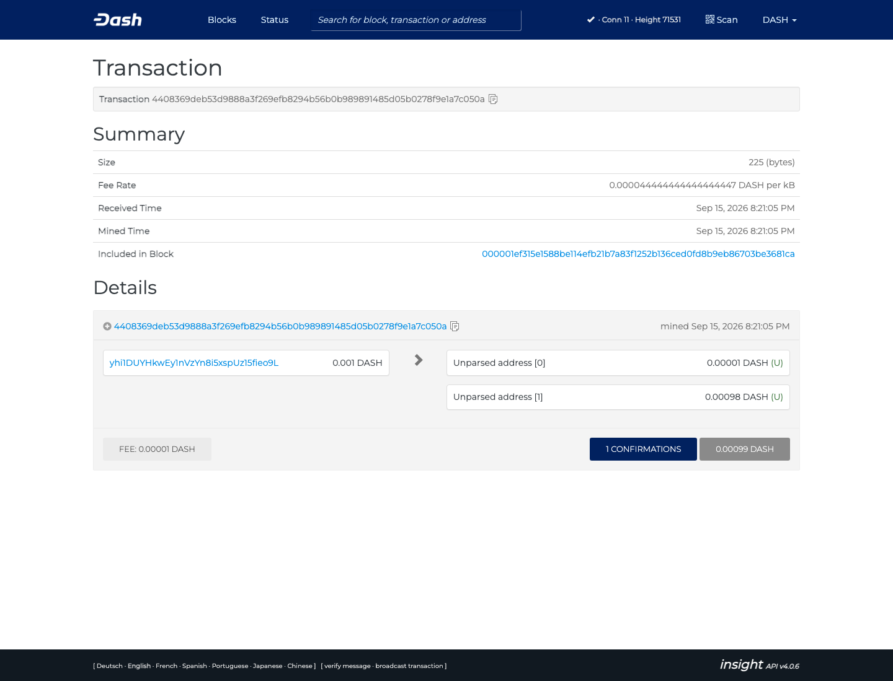

# Real devnet commerce payment and order readback

A dedicated QA payer sent 1,000 duffs (0.00001000 DASH) on Moutai to a fresh controlled merchant address while Yappr checkout was watching. Yappr detected the new UTXO, filled the actual transaction ID automatically, and successfully created an encrypted order. Fresh buyer and seller sessions both decrypted the order. Independent Core/Platform reads confirm the payment output and order. No real goods or shipment were involved.

## Revisions and scope

- Store creation, payment method, product creation, and fresh order readback: staging `c98a6ecd7e26ae5bc9fc8e400e6011eb8465b3a0`, local static server port 3260.
- Baseline checkout reproduced existing QA25 / PR432: a DASH-denominated item paid with tdash shows **Amount not calculated / Price unavailable**. No payment was sent during that baseline attempt.
- To complete settlement testing, an isolated local integration applied the exact PR432 commit `79e2d96eaabfbd1ad220bdd12e860401079714f7` to c98a. Integration revision `9b98d2096f10ea4ed074d0b121d753a0c666314a`, exact devnet build, port 3261. This is explicitly not a clean staging pass.
- All screenshots use Chromium 1440×1100 and the unchanged Node static adapter. App actions were ordinary UI actions. Dedicated authentication storage fixtures came from earlier actual sign-in flows; no payment response, UTXO, DOM or order result was mocked.
- The sender is an isolated SDK-backed QA wallet. This does not establish external-wallet GUI or QR login interoperability. See wallet-compatibility.md.

## Public fixture identifiers

- Merchant persona51: `9enksyZPnWQUovGXXAQ879uJtBvbHTUY3ewJ5Tq5QNVe`.
- Buyer persona52: `5rxCEiuGfwPkYFQ94mvxDaDG7W7dEdpU2zhq7aTLJ1cM`.
- Store: `GJdJn1iWx9CdtqRXetwa39Kkr3ZG2fBajQbcE1u6aJKr`.
- Product: `EXE3eDzteGQshhbMuyhBZWGcMaeM5Qersv1nNYtJG1YW`, one item priced at 1,000 duffs.
- Fresh payer: `yhi1DUYHkwEy1nVzYn8i5xspUz15fieo9L`.
- Fresh payee: `yVUvQLRm6SYfjT46KoozgAA5y3AaxHxSj8`.
- Actual purchase tx: `4408369deb53d9888a3f269efb8294b56b0b989891485d05b0278f9e1a7c050a`; verified in block 71531 with InstantSend and 5 confirmations at final readback.
- Paid order: `2T8ThBeiKHy7ajPLe1bzjGgyN9RudXZXhaQ1byNZS7uZ`.

## Visual evidence

Baseline amount failure (existing QA25):

The explicitly disclosed PR432 integration displays the correct amount:

The actual transfer is detected without entering a transaction ID:

Fresh readback from both accounts:

Independent actual transaction explorer:

## Findings and practical limits

- Existing QA25 / PR432 blocked amount calculation on clean staging and was reproduced.
- Existing tiny-DASH display precision issue rounds this product/order to 0.0000 DASH outside the payment component; this is not a new finding.
- QA69: the seller payment verification link opens the testnet explorer for this devnet transaction. Its API returns 404, while Moutai confirms the transaction. The corresponding individual PR uses exact clean-base/head evidence against this same already-paid order; the currency integration is not part of that PR.
- The product Price input still shows a dollar prefix when currency is DASH; this distinct product-form label issue is QA70.
- A few harness locators were corrected before continuation: store creation redirects to the store list; the store form contains more than one select; Add Payment Method appears in both warning and settings; seller order headers display the buyer rather than the short order ID. No duplicate store, payment, or order was submitted.

The funding transaction moved 100,000 duffs from the previously dedicated QA treasury to the new payer, plus 1,000 duffs fee. The purchase moved 1,000 duffs to the controlled payee plus 1,000 duffs fee. Keys remain solely in the private QA fixture, never in this evidence. No faucet request or personal wallet was used.
