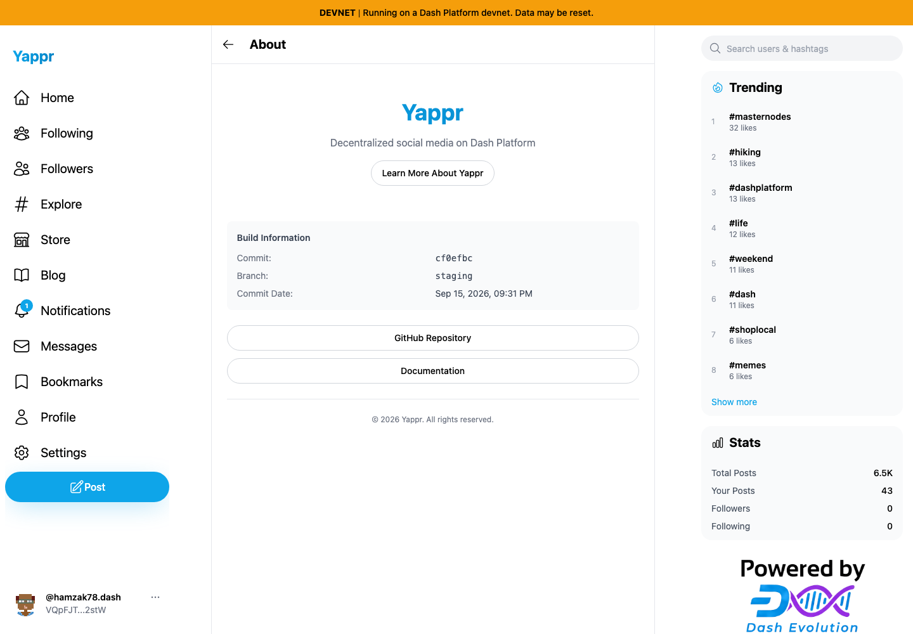

# Live Yappr devnet deployment observation

At 2026-09-16 03:14:14 UTC, the normal Settings → About panel at https://yap.pr/devnet/settings/?section=about showed commit `cf0efbc`, branch `staging`, and commit date Sep 15, 2026, 09:31 PM (America/Chicago). A fresh `git fetch origin staging` resolved `cf0efbc10b8757137063113ebbd2061e8b87d8f7` — the merge of #448. The live revision and fetched staging agree at this observation time.

This is a deployment observation, not before/after fix evidence or an integration pass. Fresh Chromium context, 1440×1000, scale 1, light theme, en-US, America/Chicago. Settings requires authentication, so existing QA persona53 signed in through the ordinary identity/private-key form; no session injection or state-transition writes. No credentials were printed or captured. The final screenshot was captured after the navigation animation settled and inspected at original resolution. [Recorded visible text and timestamp](deployment.json).
