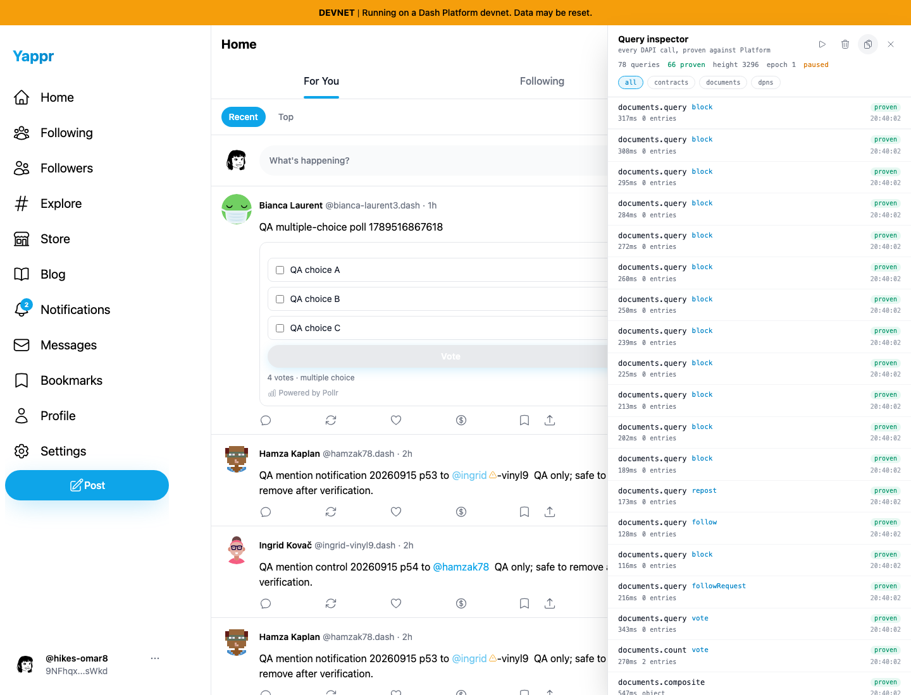
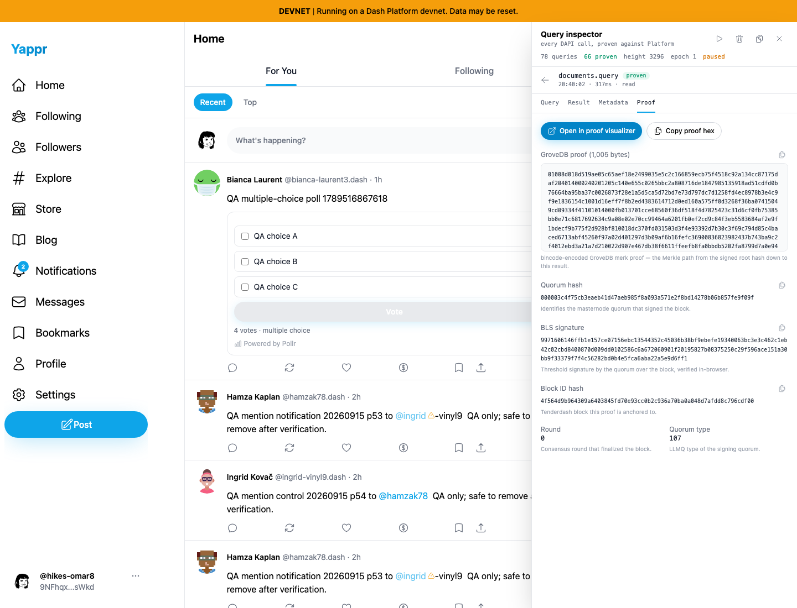
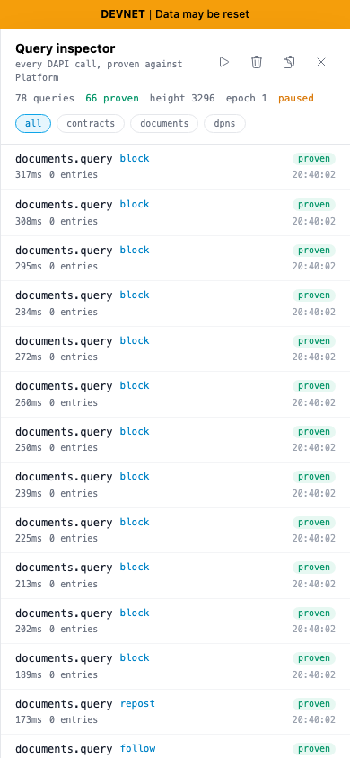
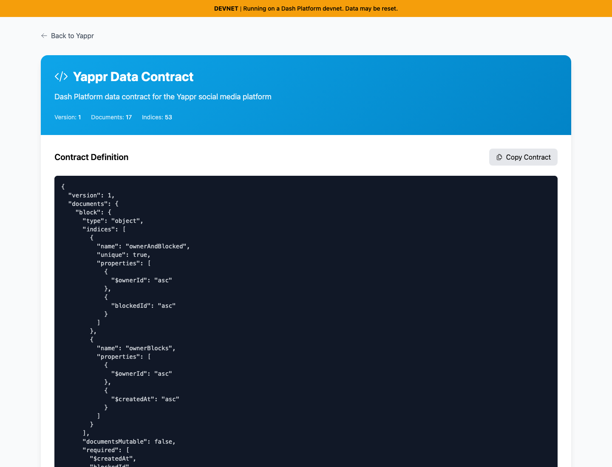
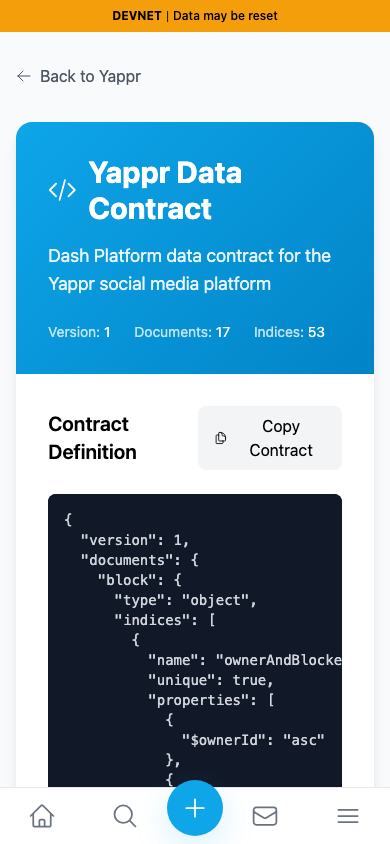

# Current staging developer inspector and contract QA

Exact source `c98a6ecd7e26ae5bc9fc8e400e6011eb8465b3a0`; independent production devnet export at localhost:3260. Same-revision feature checks, not a before/after fix comparison. Normal UI password sign-in as existing synthetic persona 39; fresh Chromium context, en-US, America/Chicago, light theme, desktop 1440×1100 and mobile 390×844. No response mocking or query injection. Inspector enabled only after authentication and captures ordinary public-feed reads. No private authentication or clipboard contents are included in the report.

Passed:

- Inspector starts disabled with Clear unavailable; Enable reveals the named live pill.
- Actual navigation captures 78 successful request/helper records across eight method names; 66 are shown with proof status. Helpers without proofs are distinct in the UI.
- Pause/Resume controls toggle; paused records remain stable while navigating Explore.
- Query, Result, Metadata and Proof tabs show a real captured document query. Copy proof hex exactly matches the displayed 1,005-byte proof; the normal visualizer action opens its configured external origin.
- Contracts/Documents filters match the corresponding copied JSON records.
- Mobile inspector fits 390 pixels; Clear removes records; Close returns the pill; Ctrl+Shift+Y disables it.
- Enabled preference survives reload; records, panel-open state and pause state reset. No pre-reload record ID remains.
- Contract display and actual clipboard JSON exactly match checked-in v6 version 1 with 17 document schemas and 53 indices. Desktop/mobile remain within the viewport; code supports its own horizontal scrolling.

All five final PNGs inspected at original resolution. [Assertions](developer-results.json). No new confirmed issue from these checks. This is UI/integration coverage, not independent certification of proof correctness or all SDK methods. Writes, 300-record eviction, oversized-proof fallback, clipboard-denied handling and all external visualizer interactions were not exercised. Initial harness mistakes using a nonexistent `main` landmark on the separate contract info page and checking a nonexistent `success` status instead of `ok` were corrected before this final run; neither is a product defect. Inspector disabled again before the disposable browser context closed.

## SHA-256

- `7ed0d69fe6d4422a11f14c01a38fb54ede82bf229ff9b9410a6a7edd7b988570` — `contract-desktop.png`
- `67d309177a9ac7be6522a61d3f01b4526e6255e4807beb71f2ada923b292e2f3` — `contract-mobile.png`
- `325fb28dca0cd8c44314672b04173f8dba0eb0434ed196af37058450642457a0` — `developer-results.json`
- `4b4e10432561b0ad11eca1ee63d1e2952029f61dc2aac4ee45d8065d800ad8a5` — `inspector-desktop.png`
- `06ce8fbcabaf45fbdade18fc8ab1cc9929ebce8d50e24f7b37d317ae4af2bf76` — `inspector-mobile.png`
- `0439929327b54752d972ab30bd59553467b91e71d7a86afd544d5504fa79e5f4` — `inspector-proof.png`
