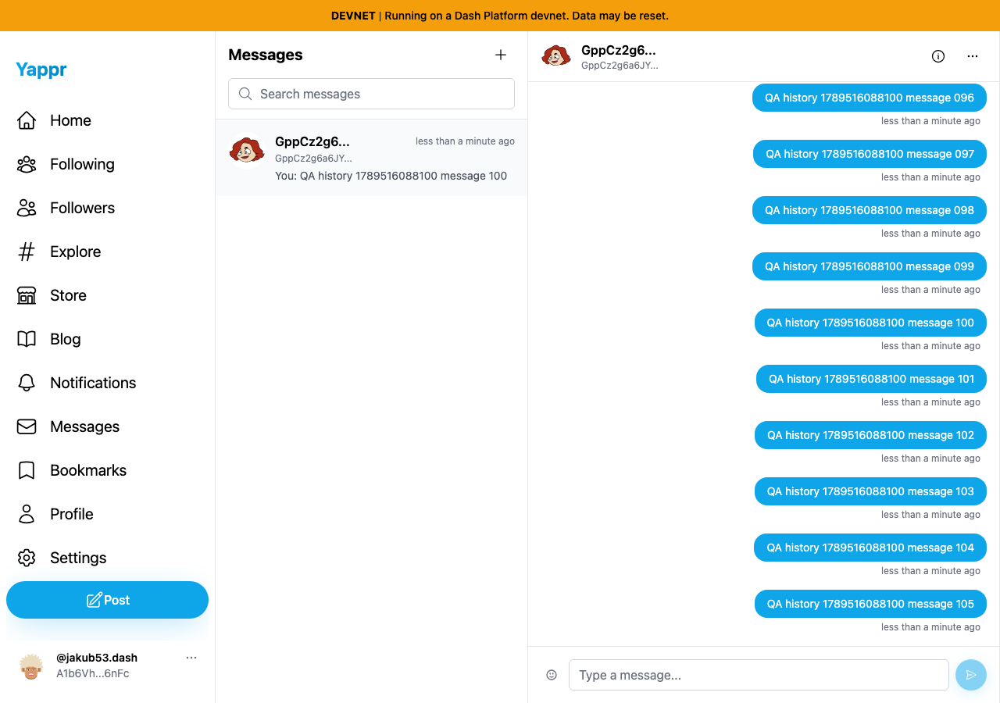
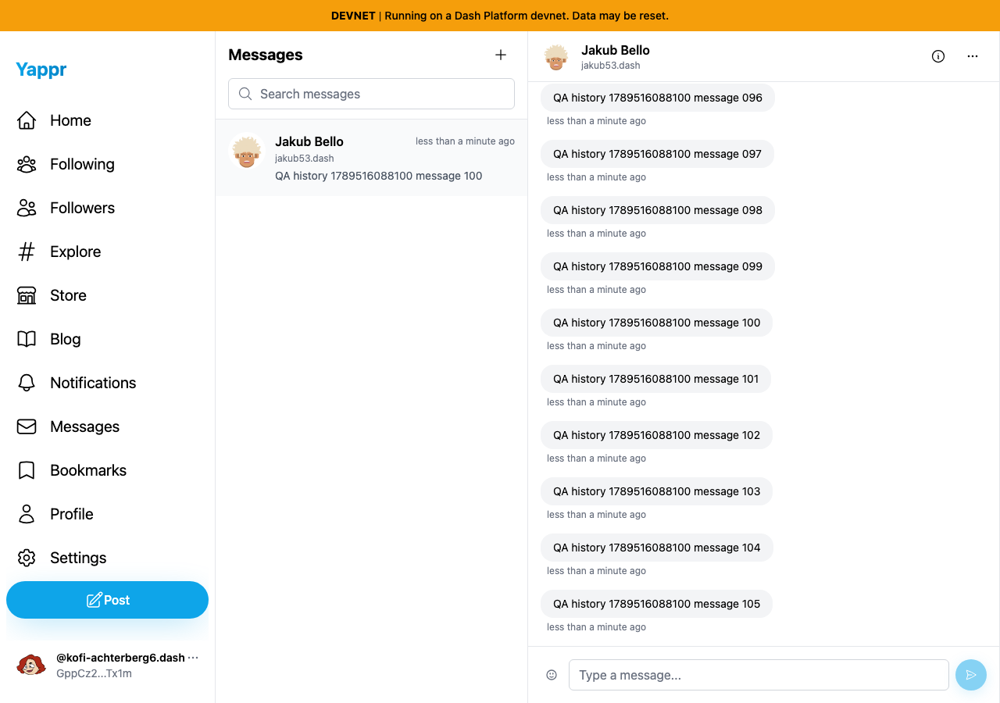

# Long direct-message history

Exact committed head `92103239f305cb7f61201c2627183817a25f404f`, production devnet build port3248. Persona59 sent105ordinary messages sequentially through the UI to persona60. No responses or content were mocked. Private seeded sessions are disclosed; no actual-login claim.

Marker `QA history 1789516088100`; sender `A1b6VhEArph6vYnvMdVVm8Wc4e4bkfcA3CeXjMoa6nFc`; recipient `GppCz2g6a6JYr7rGtwpEc4VgDX7b7wifz8uWXM1CTx1m`.

Fresh independent sender and recipient sessions each display all105messages. A follow-up check scopes assertions to the message-thread container and verifies each marker occurs exactly once. Screenshots show the end of the thread; JSON records the full105assertions. The existing conversation-list preview stops at message100 even though the thread reaches105; that is a separate newly confirmed UI issue, not a pass for preview correctness.

Both1280×900PNGs inspected at original resolution. Real QA messages retained as test fixtures; no data-loss claim.
