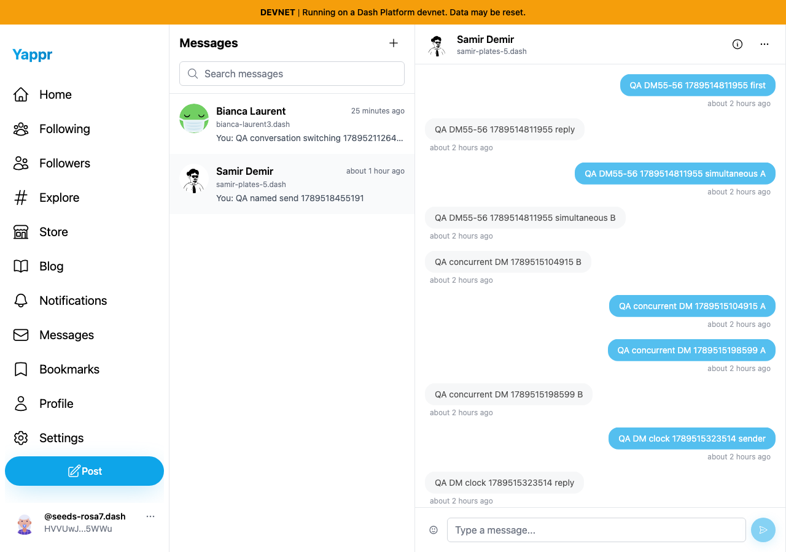
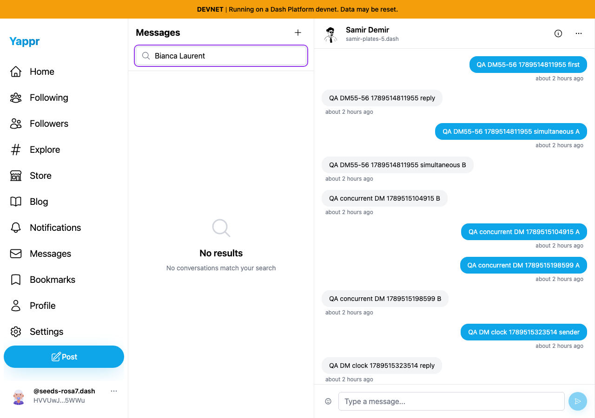
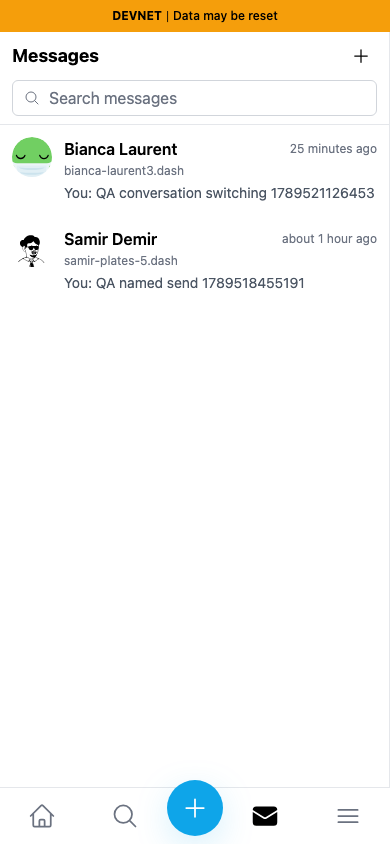

# Direct-message conversation switching

Production devnet baseline `c98a6ecd7e26ae5bc9fc8e400e6011eb8465b3a0`, served locally on3260. Controlled seeded sender55 and recipients56/57; exact public IDs/markers in fixture.json. Scoped QA sessions are provisioned programmatically; this does not certify sign-in.

A real message to recipient57 was created through normal UI and decrypted by a fresh recipient session. Subsequent checks made no additional writes. Six alternating selections correctly displayed each thread's own marker and excluded the other thread's marker. ID-prefix search, no-match state, clearing search,390pxback/list transitions all passed. Screenshots inspected at original resolution; no secrets are present.

Searching the visible display name Bianca Laurent incorrectly hides her existing conversation. This is QA72 and will be fixed separately. Message-content search was not tested or promised by this case.

