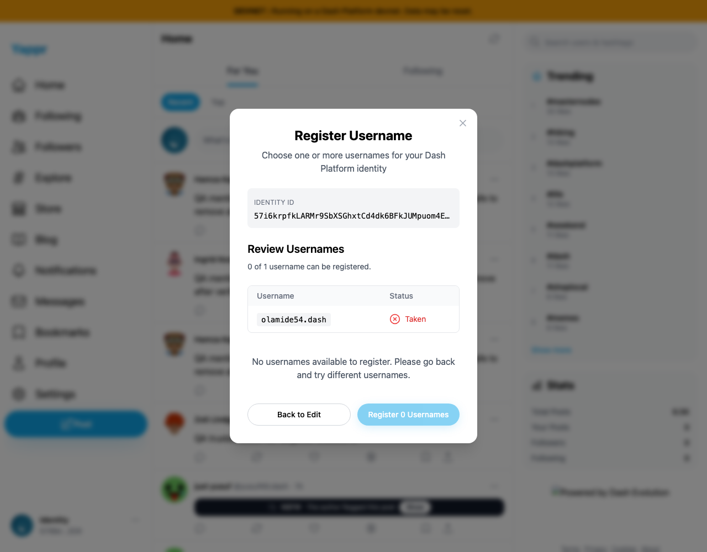
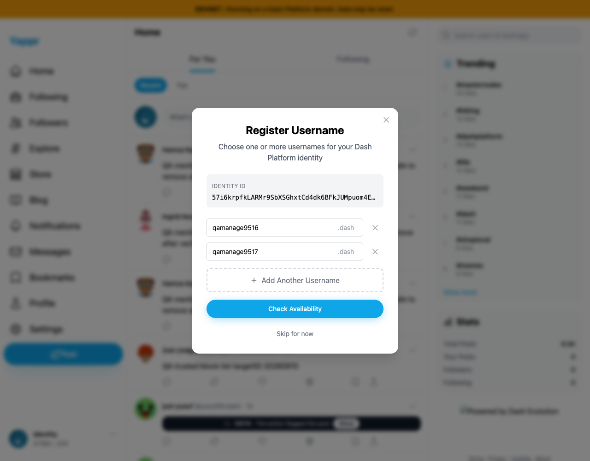
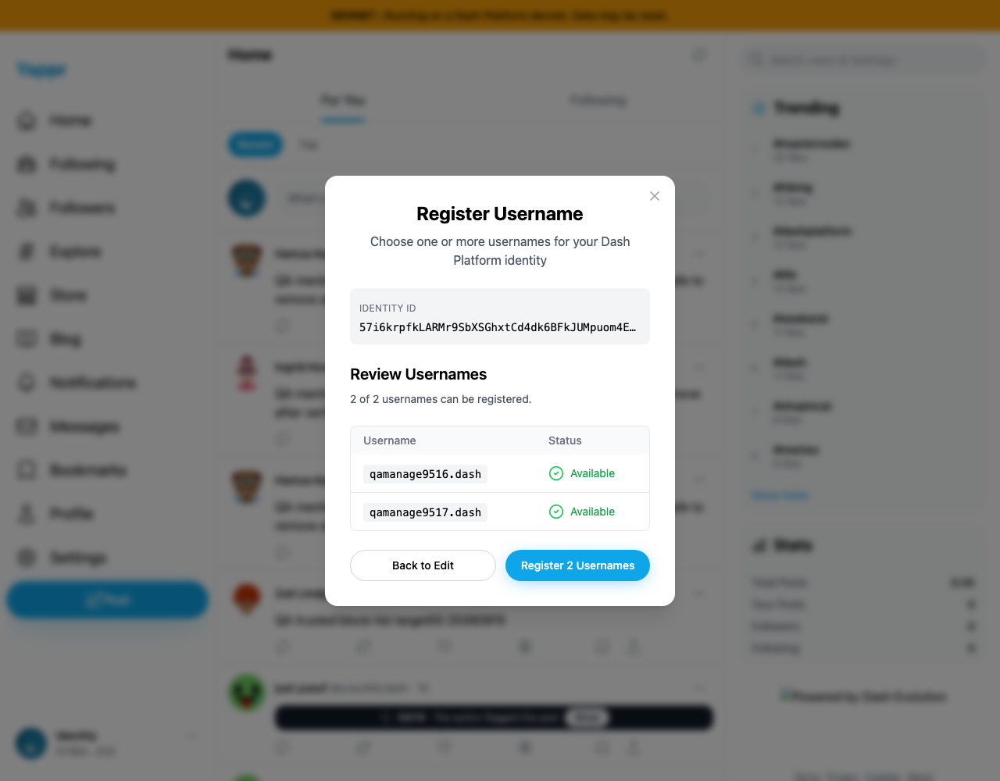
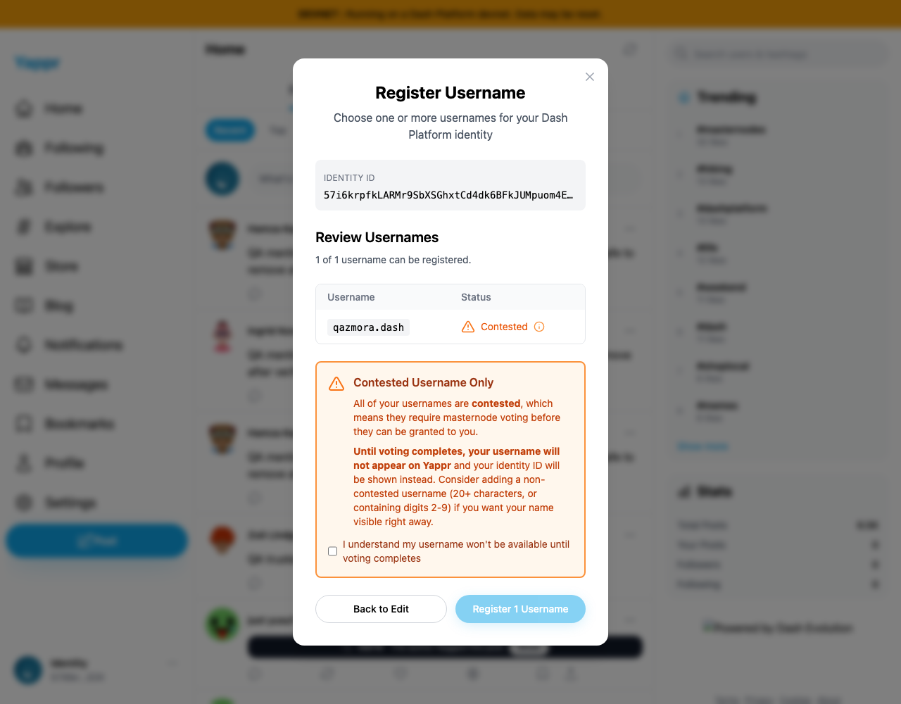

# DPNS management QA

Actual UI login on staging revision `eb895be71a7207c73fb9329ac9d9bb7b398f53da`, live devnet reads, Chromium at 1280 × 1000. No username registration, vote or auth-vault creation was submitted.

Passed: existing name is Taken and cannot register; add/remove middle row preserves other values; two distinct names check Available; uppercase input normalizes; contested-name guidance requires acknowledgement before Register enables and disables again when unchecked; dismiss keeps identity unnamed.

Confirmed QA-50: duplicate canonical names offered as two registrations. No duplicate write was submitted.

Confirmed QA-52: remove-row button has no accessible name. The username textbox has a placeholder-derived accessible name; it is not unnamed. Separate exact-base/head PR evidence is in the sibling PR artifact directories. SDK canonical-label readback is included in `canonical-sdk.json`.

The repository Node adapter omits a footer logo that loads with an alternate prefix-stripping adapter; this is not counted as a product defect. All screenshots were reviewed at original resolution and contain no private keys.
