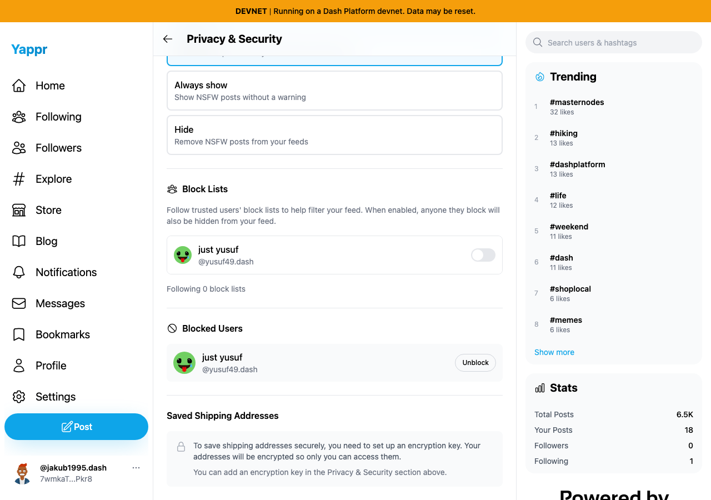
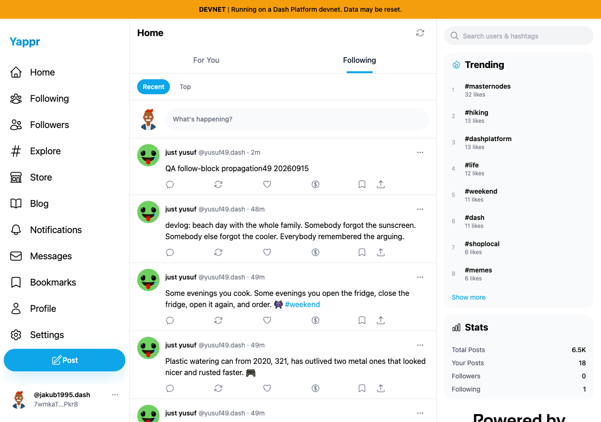
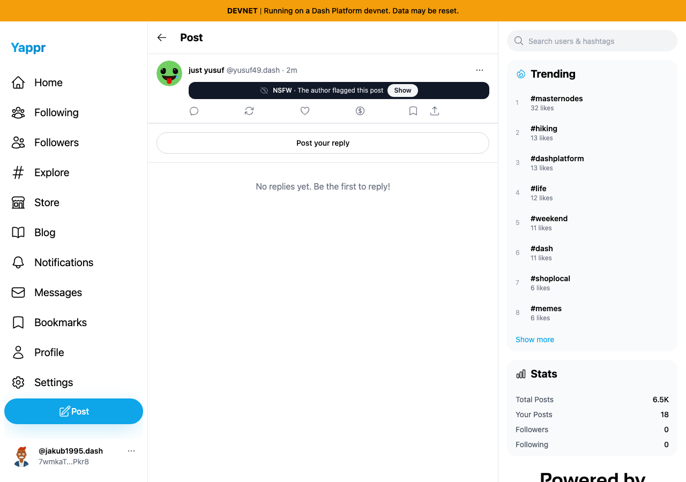
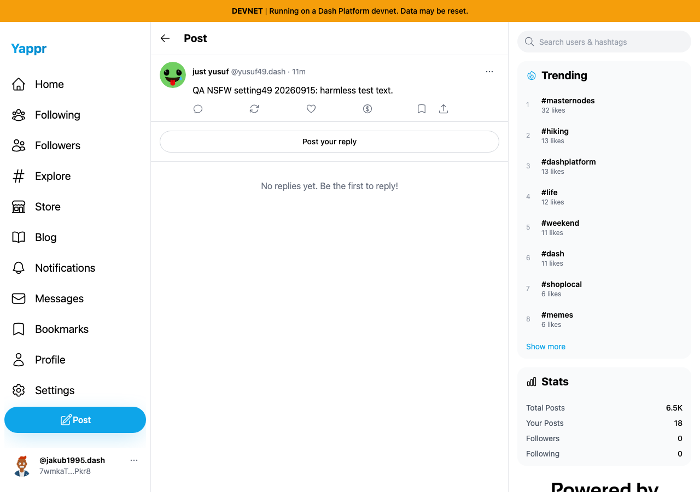

# Live follow, block and NSFW preference QA

Actual https://yap.pr/devnet/, deployment4105c5d1c914f5d0838619da93c3b8d28b4a780e,1280×900. Independent disposable seeded QA sessions; no login ceremony claimed. Personas48/49; public object IDs in state.json/nsfw-state.json. Ordinary browser actions; no response or page fabrication.

Passed: follow49, fresh Following includes created post; block from post menu, fresh profile warning and blocked settings row, target absent from fresh feed; unblock from settings and fresh target post reappears; unfollow restored initial no-follow state.

A quick feed-tab switch sometimes included unrelated public posts; this is a separate confirmed QA-28 stale-request issue, not an all-clear for Following. Target-specific block/unblock state was confirmed independently.

Harmless NSFW QA text was published via composer toggle. Default warning hides the text; Show reveals it; reload resets the one-post reveal. Always show and Hide persist after reload. Hide removes the post from list feed but deliberately retains a warning on its direct detail. Warn first and follow relationship restored. Screenshots show sequential preference states, not a code fix.

Initial automation tried to click the visually hidden radio directly; its visible label worked normally, so that timeout is not a product defect. The Always show screenshot was recaptured after author resolution; relative time differs. All four final images inspected at original resolution. QA posts remain available for follow-up testing. Trusted block-list propagation and profile-level NSFW flag changes are separate stories.
