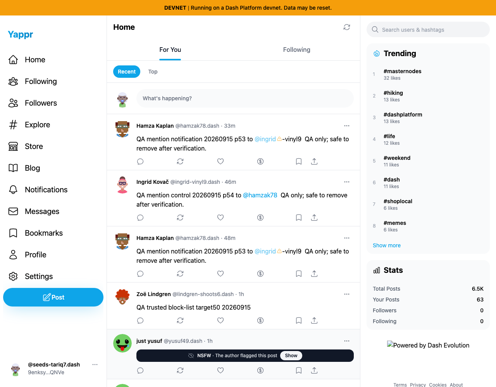
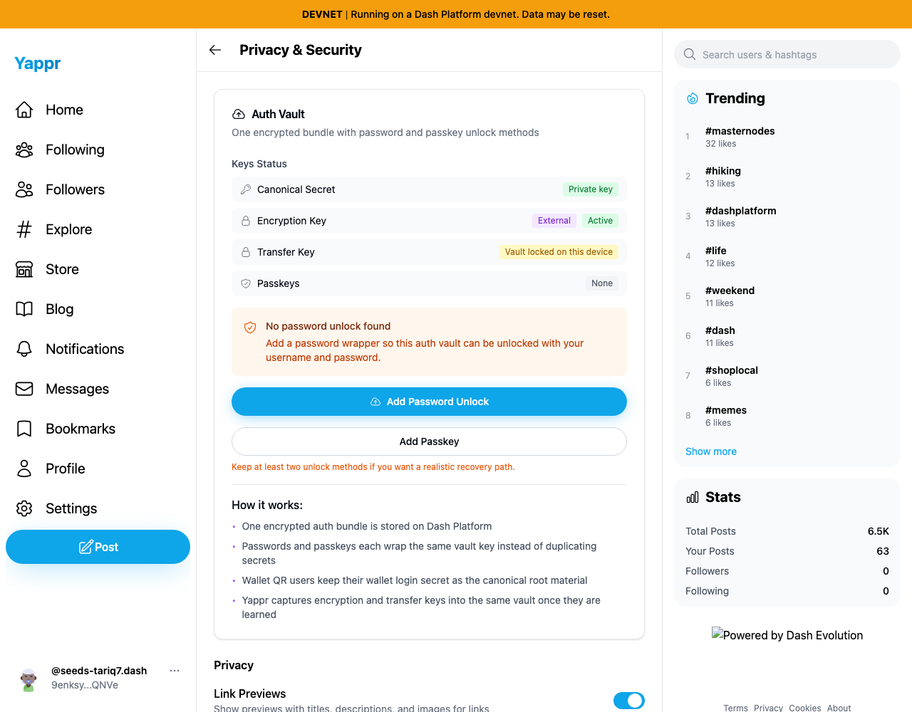
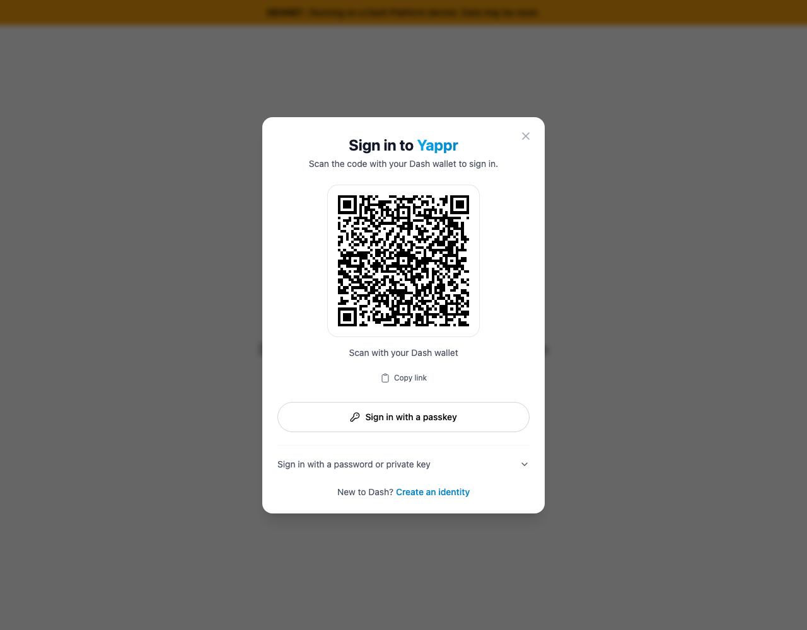
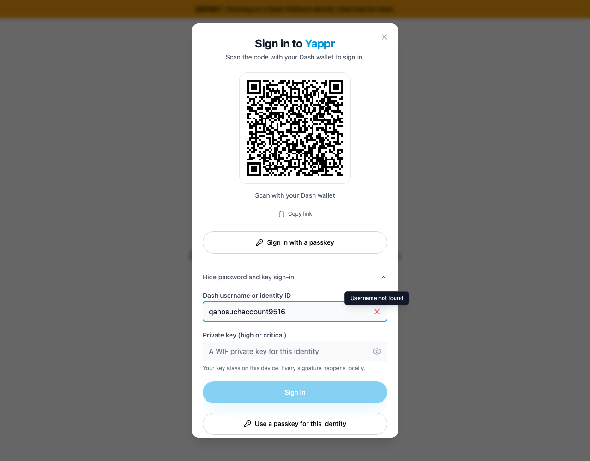

# Actual key login and session restoration QA

Staging revision `eb895be71a7207c73fb9329ac9d9bb7b398f53da`, Chromium at 1280 × 1000, live devnet, dedicated persona51. No localStorage or session fixture injection. Login and key restoration used actual UI, and the browser restart used a dedicated persistent Chromium profile. Private profile/keys are not published. Ended logged out.

Passed: identity ID with HIGH authentication key signs in; encryption key restores using Enter Key → Save Key; reload preserves session/key; a new Chromium process restores them from disk; Log out removes session and every scoped secret entry; reload remains logged out; `.dash` username with CRITICAL authentication key restores the same identity; second logout clears stored secrets; nonexistent username is rejected with Sign In disabled. No passkey/password enrollment or on-chain key creation was performed.

`result.json` records executed steps and secret-entry counts, never secret values. The unknown-username screenshot was recaptured to reveal its tooltip and inspected again. Public wallet-request QR codes are ephemeral authentication requests, not private key material. The footer-logo omission is a local static-adapter artifact, not a product defect.
