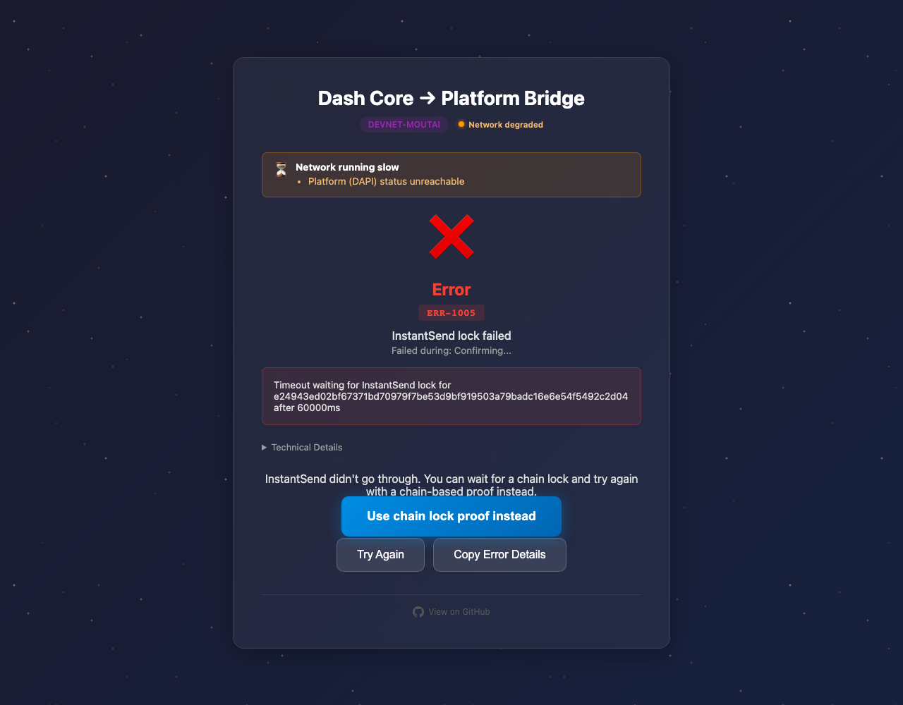
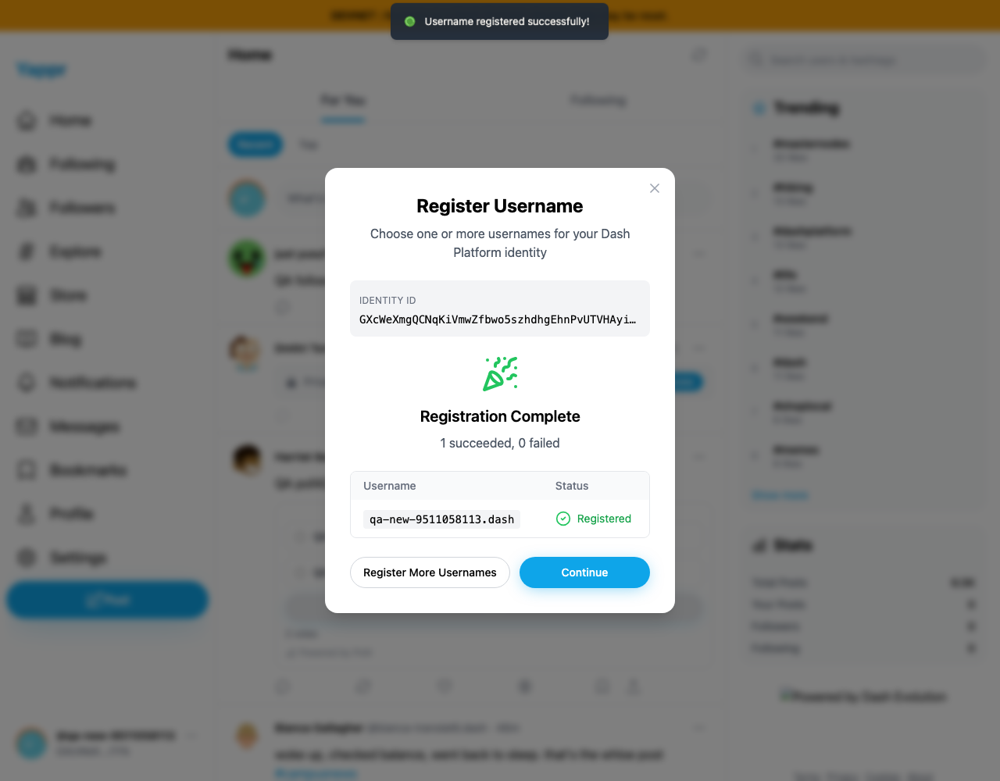
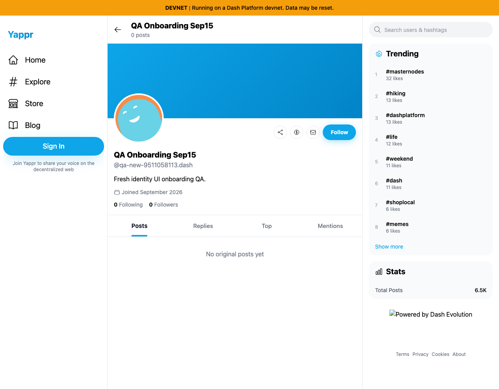

# Fresh identity and onboarding QA — 2026-09-15

Exact Yappr staging `4105c5d1c914f5d0838619da93c3b8d28b4a780e`, locally built `/devnet`, live Moutai Platform. This records functional QA, not a before/after fix comparison.

| Story | Result |
|---|---|
| Open Create an identity from devnet | Failed: external bridge defaults to Testnet. Fixed separately by [PR430](https://github.com/PastaPastaPasta/yappr/pull/430), with exact before/after evidence. |
| Create identity with bridge's supported Moutai flow | Incomplete: default bridge key generation and funding succeeded, then InstantSend timed out after 60 seconds. Visible chain-lock fallback remained waiting at the end of the six-minute browser observation. |
| Recover that bridge-created asset lock using documented SDK tooling | Passed: same keys and lock registered identity; independent Core chain-lock height71352 exceeded lock block71346. This recovery is not a successful bridge UI ceremony. |
| Sign in to Yappr with that identity and critical private key | Passed using actual login form, no injected session. |
| Check availability and register a new DPNS username | Passed using actual form, confirmation, and Register1Username action. |
| Create a profile | Passed using actual Create Profile form; display name/bio persisted. |
| Read profile and username in an independent fresh guest browser | Passed; also independently read from Platform SDK. |

Identity: `GXcWeXmgQCNqKiVmwZfbwo5szhdhgEhnPvUTVHAyi1Yk`. Registered username: `qa-new-9511058113.dash`. Profile: `AZzqbf4eoLwFysPGLx3J7N9QddW2qECSJ2ZpCLcvwvp2`.

The Moutai faucet was requested once using its actual public form (fixed10devnetDASH). A0.08devnetDASH deposit funded the bridge-generated address. Public funding and recovery records are included. Keys and recoverable treasury change remain private, outside this artifact.

## External bridge failure

External bridge's served revision is unknown. Its status banner reported DAPI unreachable; Yappr's current SDK subsequently registered the same identity successfully. The observation does not establish a Dash Platform or GroveDB defect. The chain-lock fallback wait is recorded in `bridge-create-browser.json`.

## Actual Yappr username and profile flow

The first login exposed both Register Username and Protect Your Auth Vault in the DOM; backup was on top. Skipping backup allowed username onboarding to proceed. `first-login-prompts.png` records the visible blank backup prompt; it does not visually prove the hidden username dialog. This is an onboarding sequencing observation requiring separate validation.

`profile-create-filled.png` and `profile-created-readback.png` cover form input and signed-in readback. `independent-readback.json` records the SDK username resolution and profile document; `fresh-guest-readback.json` records independent browser assertions. Public identity/network data is retained, unrelated feed text is omitted. No secret-entry screenshots are included.
