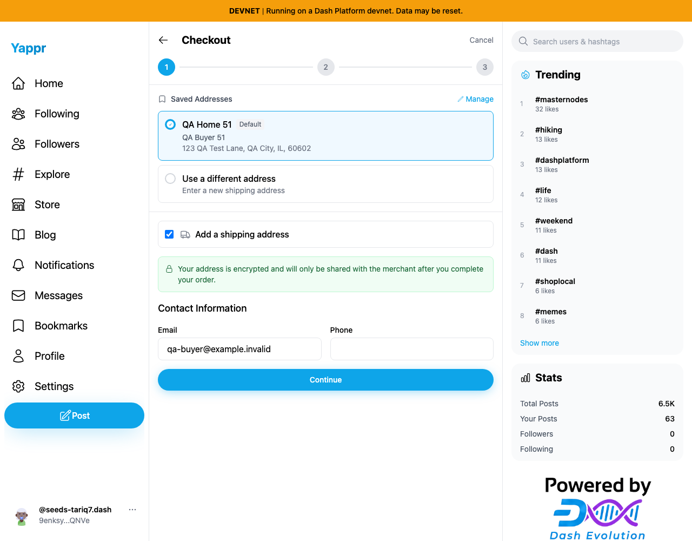
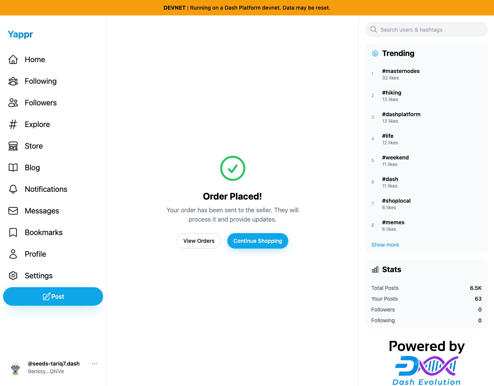
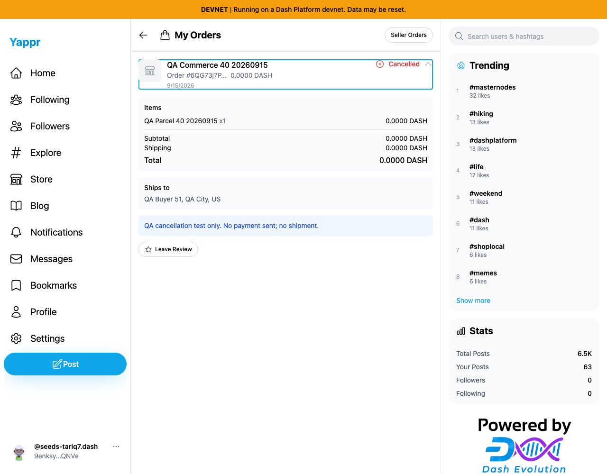
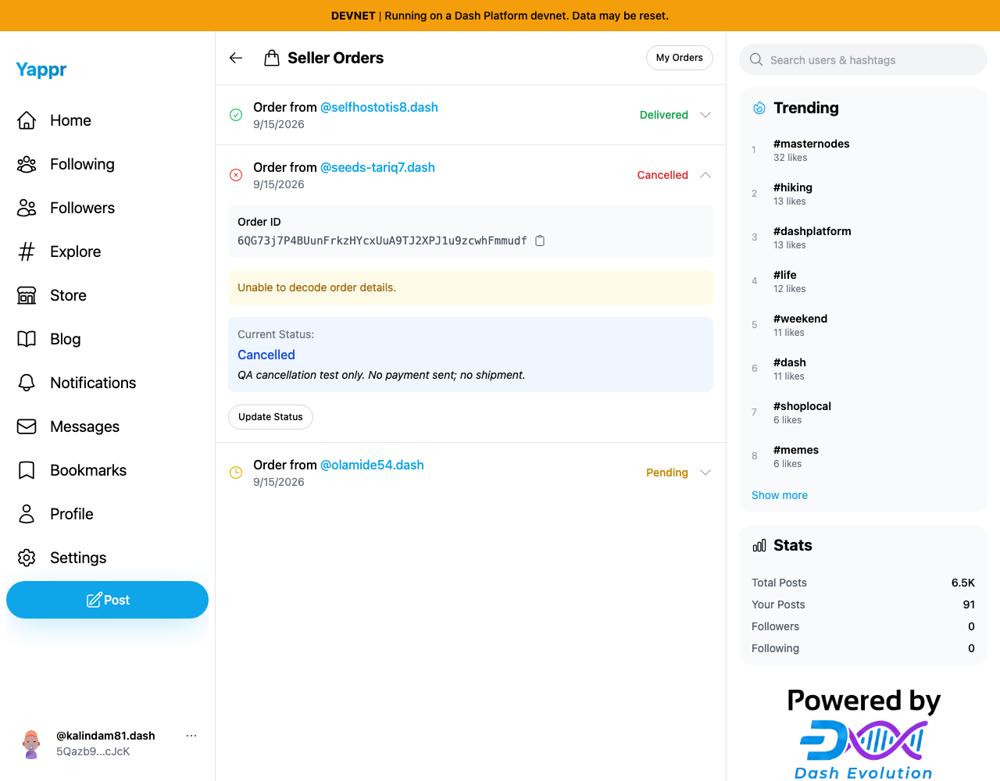

# Saved-address checkout and seller cancellation

Exact live baseline `4105c5d1c914f5d0838619da93c3b8d28b4a780e`. Buyer51 `9enksyZPnWQUovGXXAQ879uJtBvbHTUY3ewJ5Tq5QNVe` placed new QA order `6QG73j7P4BUunFrkzHYcxUuA9TJ2XPJ1u9zcwhFmmudf` against seller40 `5Qazb9Ncc7LgLSSWkPj36Qpp5ZpEoQEcHNR2Ync7cJcK`. No payment or shipment was sent. Existing delivered order was untouched.

Passed: select saved synthetic address/contact; agree to test policy; create unpaid encrypted order; seller updates only this order to Cancelled with a QA message; fresh buyer session decrypts items/address and displays Cancelled plus the message. Independent SDK reads cancellation document `CpW1GZ11M7m9TmTosS8TeTM1aon5tYGpPebX1XT56Yx1` with status cancelled.

| Order placed | Fresh buyer sees cancellation |
|---|---|
|  |  |

The seller session intentionally restored only the auth key, so its Unable to decode order details notice is expected fixture state, not a newly claimed decryption bug. Buyer decryption succeeds with the restored encryption key. Seller details decryption is covered by the earlier commerce QA.

The first rapid checkout attempt reproduced the already-tracked shipping lookup race (PR 431); waiting for the lookup and retrying the unchanged US address allowed progress. Item 100 duffs + shipping 200 duffs renders as 0.0000 DASH in this baseline; that previously confirmed precision issue is fixed separately by PR 426. Captures do not claim either is fixed here. The payment-screen QR is the public QA receiving address, not key material. All six included images were inspected at original resolution.
