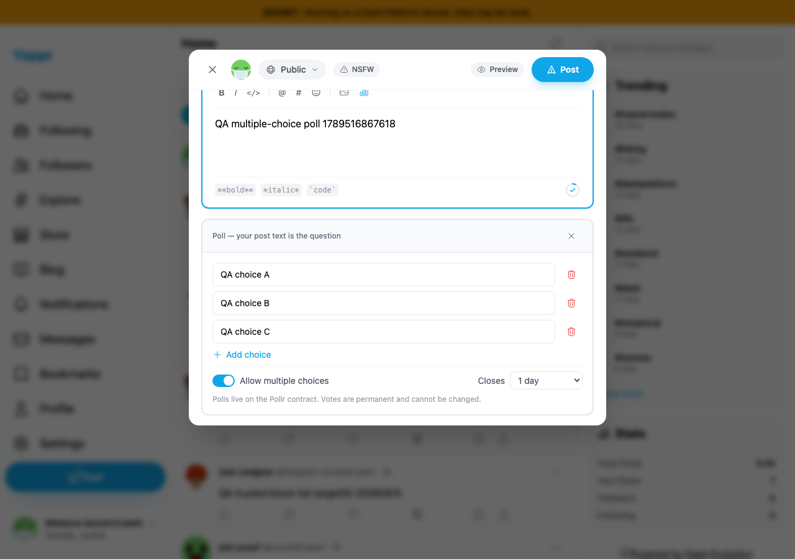
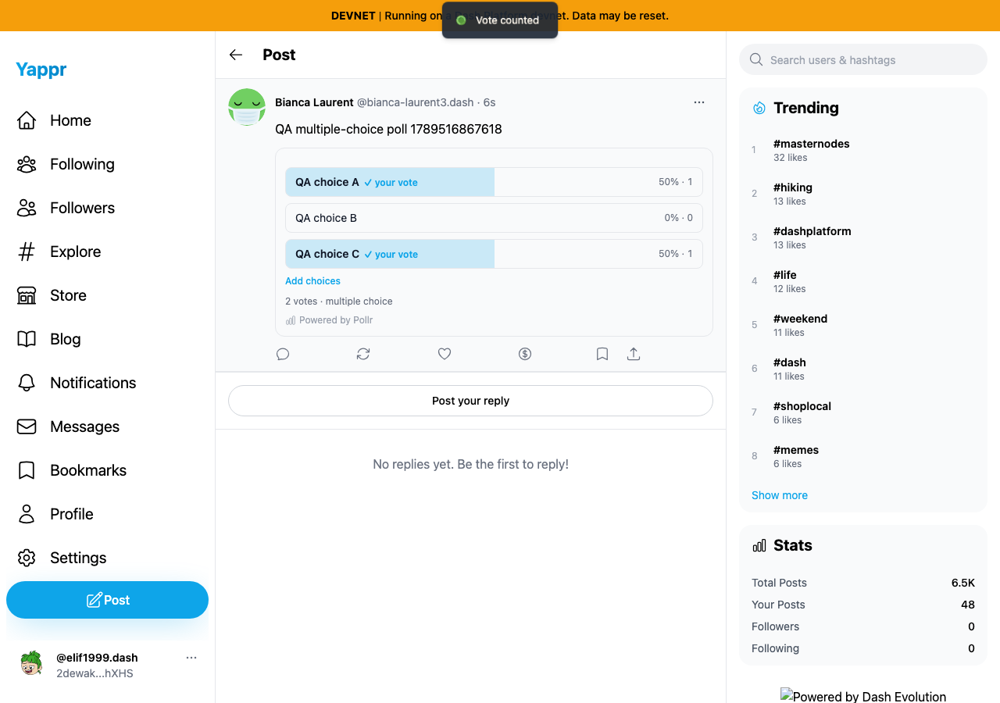
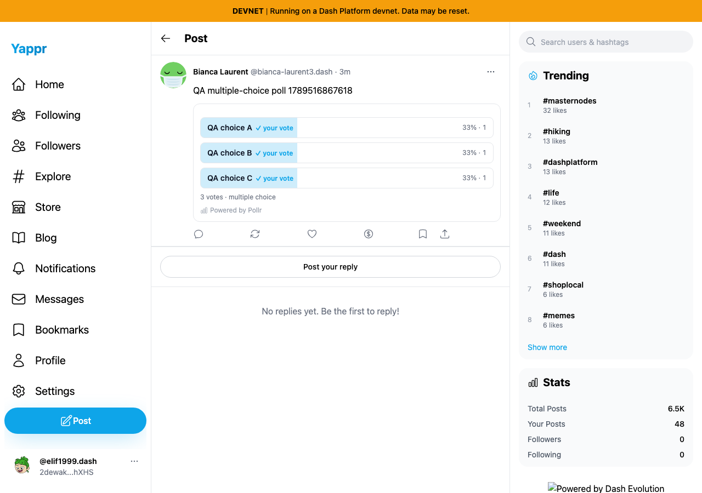
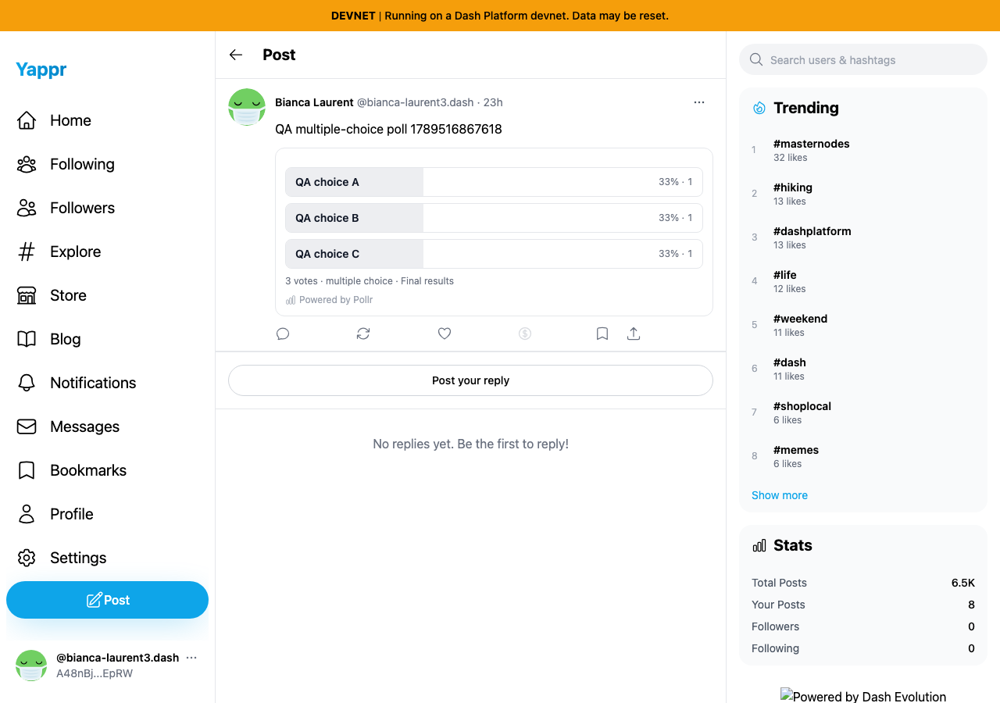
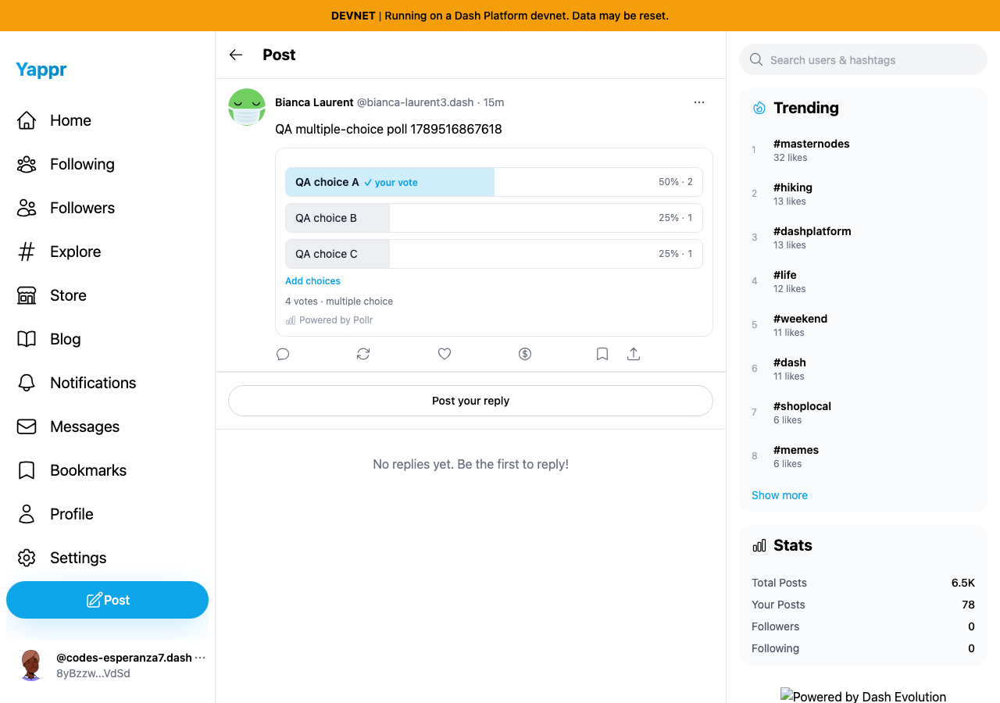

# Poll creation, multiple choice, cancellation and closure

Exact baseline `eb895be71a7207c73fb9329ac9d9bb7b398f53da`, committed devnet production build port3240. Private seeded QA sessions; no network or document content mocked. Persona57 created the poll,58 cast three choices,61 cast one choice. Post `A97wUuDzx6uxJAKKxicTJZHrhL4huq8w58uiSXZM7tHa`; poll `AAoa2iqsv1QEq9UPoYxX6R6y3SPVvizT2dHaPaVttZ7y`; question marker `1789516867618`.

Normal composer checks passed: fewer than two filled options disables Post; add stops at ten draft options; remove returns to three; multiple-choice toggle and all four duration selections work. The actual published poll has three choices, multiple choice enabled and one-day close time. Independent SDK readback confirms its immutable document and `endsAt=1789603269967`.

Reader58 selected A and C, deselected/reselected C, submitted both, then used Add choices to add B. Already-recorded choices were disabled. Fresh reader58 sees all three votes and no remaining Add choices button.

A separate browser clock control loads the real poll at normal time, installs Playwright timer control before the tested page reload, then advances running timers past its committed close time. Final results replace the ballot. This tests client advisory closure, not chain-enforced deadlines or a real one-day wait. Initial fixed-clock-only experiments left a stale intermediate view until interaction; advancing timers before judging closure resolves it, so no poll-expiry bug is claimed. Future-clock fresh network reads were excluded from conclusions.

Back at normal time, reader61 voted A, opened Add choices, selected B, then Cancel. Fresh reader61 still has only A; total is now four across the two voters. The different totals across screenshots are sequential real writes, not inconsistent readback.

An initial exact-text assertion used3votes but omitted the multiple-choice suffix; it was corrected and not reported as a product defect. Five1280×900PNG files inspected at original resolution. The footer logo omission is a local base-path server artifact. Real QA poll and immutable votes remain as dedicated fixtures.
