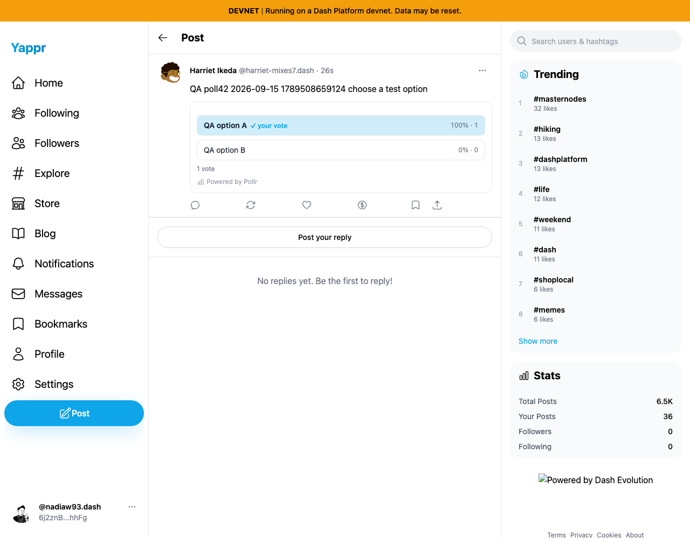
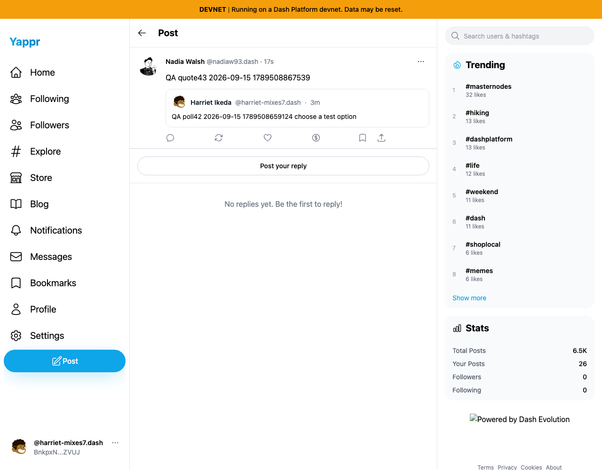
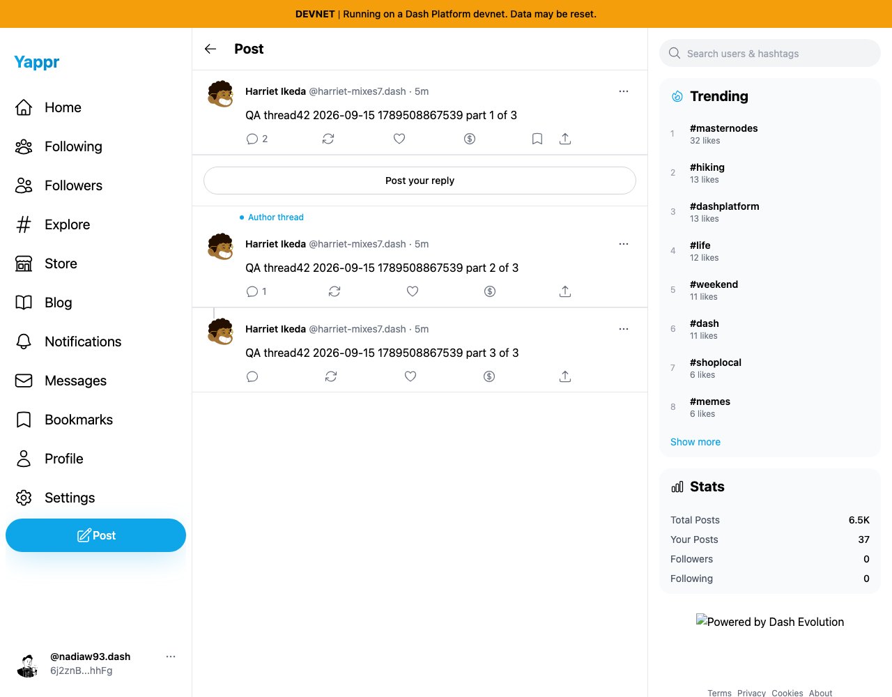

# Poll, quote, thread and own-delete QA — personas42/43

Exact staging `4105c5d1c914f5d0838619da93c3b8d28b4a780e`, independently built with `npm run build:devnet` and served at `http://127.0.0.1:3211/devnet/`. Real devnet records, restored provisioned test personas, ordinary app controls, fresh browser readback, independent read-only SDK document checks. This is normal functional QA; provisioning itself was not validated by these stories. All published images were inspected at original resolution. Secrets and credential-loading scripts are excluded.

Author42: `BnkpxN1fNp4aQdQM6EhSd12ytb84NCZeTG7rSmyaZVUJ` (Harriet Ikeda, harriet-mixes7). Reader/quote author43: `6j2znBwntSsuAAitnMLBN9YMx8cx98ZPDpod5yRjhhFg` (Nadia Walsh, nadiaw93).

| Story | Result | Evidence |
|---|---|---|
| Create single-choice two-option poll with one-day duration | PASS, post + poll persisted | poll-compose.png, after-poll.json |
| Another identity votes and reads results in fresh session | PASS, optionA selected,1vote, no repeat Vote control | poll-before-vote.png, poll-voted.png, poll-fresh-vote.png, after-vote.json |
| Quote a post | PASS, quote's `quotedPostId` matches poll post; fresh author session sees both | quote-compose.png, quote-fresh-readback.png, after-quote.json |
| Compose three-part author thread | PASS, root + two replies persisted with correct root and direct-parent linkage; fresh root page reads all3 in order | thread-compose.png, thread-root-readback.png, after-thread.json |
| Share post | FAIL, copied URL omits `/devnet`; exact copied URL opens404 locally | poll-browser.json, copied-link-destination.png; fixed separately in pr-post-share-base-path |
| Delete own quote | PASS, immediate + fresh-reader tombstone; content cleared and `deleted:true` in SDK readback | quote-delete-confirmation.png, quote-deleted.png, quote-deleted-fresh.png, after-delete-quote.json |
| Delete own replies and root post | PASS, both replies then root deleted through normal menus; fresh-reader tombstone checked for each; SDK content empty/deleted true | thread-reply-delete-confirmation.png, thread-reply-deleted-fresh.png, after-delete-thread.json |
| Edit own published post | Not exposed; own menu has Delete but no Edit | own-quote-menu.png; no edit behavior claimed |

Post IDs: poll `Aey3uVJBpk7hEUi48zxRfZMavt3pQNeTdsUXkp4zppCd`; quote `4oqu9oaaL9TRwHdPaxjtSEMhE6JHicDC4SWSEeALziZ5`; thread root `7foMhZq2UAc2QTnosgaNhUhKi1Bwv89rd8CqDVHihPUu`; replies `2KBKMfyLKHihy1791TNNYJLaETfSbdQQ3kGQJBrjgWfd` and `CSJApE3RuvpZwrox3MLyQuKEZHBxjLPP7Eo4Y1wzMBxn`. Poll `DMN4Y5rkdCiFBUmhzgzizJbMFX6RpQaqLq4666Hc6aB3`. Contracts are recorded in JSON.

## UI observations and limits

Direct navigation to part3 shows root + part3, omitting part2 from that view. The initial harness expected all3 and failed (`quote-thread-browser.json`, `quote-thread-failure.png`). Source documents that flattened reply context is intentional; the root page displays all parts. This is a reduced-context UX concern, not evidence of lost content or a failed thread write. The un-enriched root author shown there is covered by the separate reply-chain-author fix.

Own options displayed Follow and Block on the author's own card; these were not exercised. Some pre-submission and early menu captures still show asynchronous profile/visibility loading. They prove entered data/menu availability only; they do not establish permanent identity-resolution failures. `quote-deleted-fresh.png` was captured before its author enrichment finished; its ID and tombstone are correct. Missing footer logo is visible across local staging pages and is outside these stories.

The network was concurrently seeded, so unrelated stats change and the public poll later acquired another vote from outside this two-persona sequence. No count assertion is made across different capture times. Only this run's newly created quote/thread were cleaned up; their tombstones remain on-chain. Poll/post were preserved for exact Share before/after comparison. The public document snapshots were filtered to this run's records before publication.
