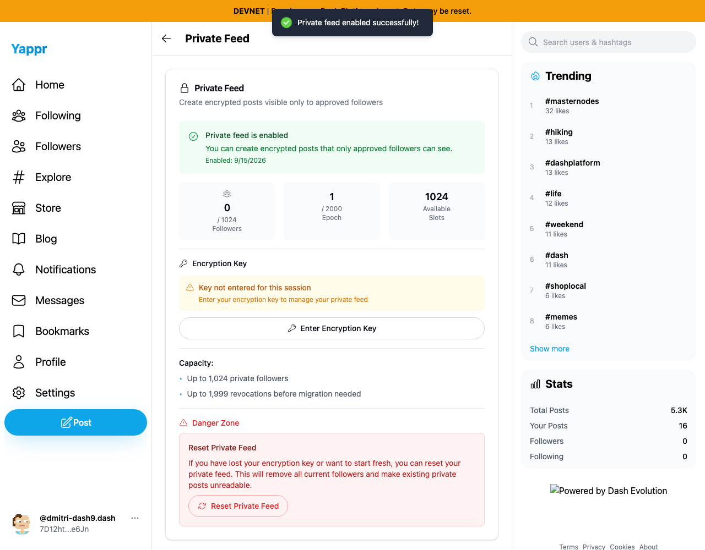
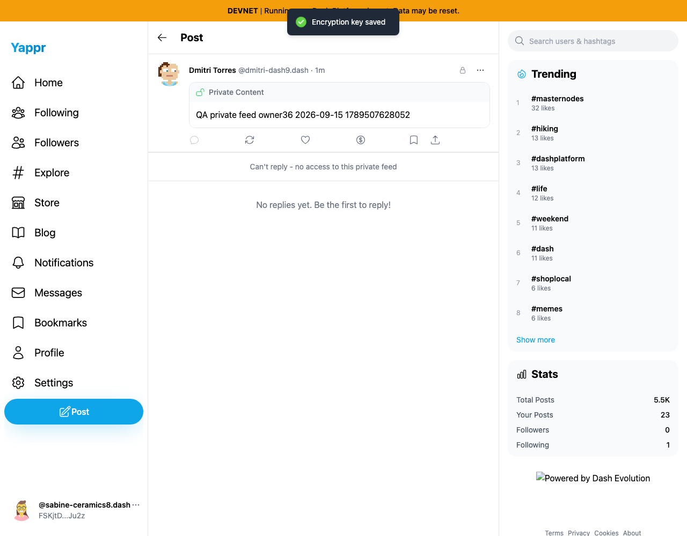
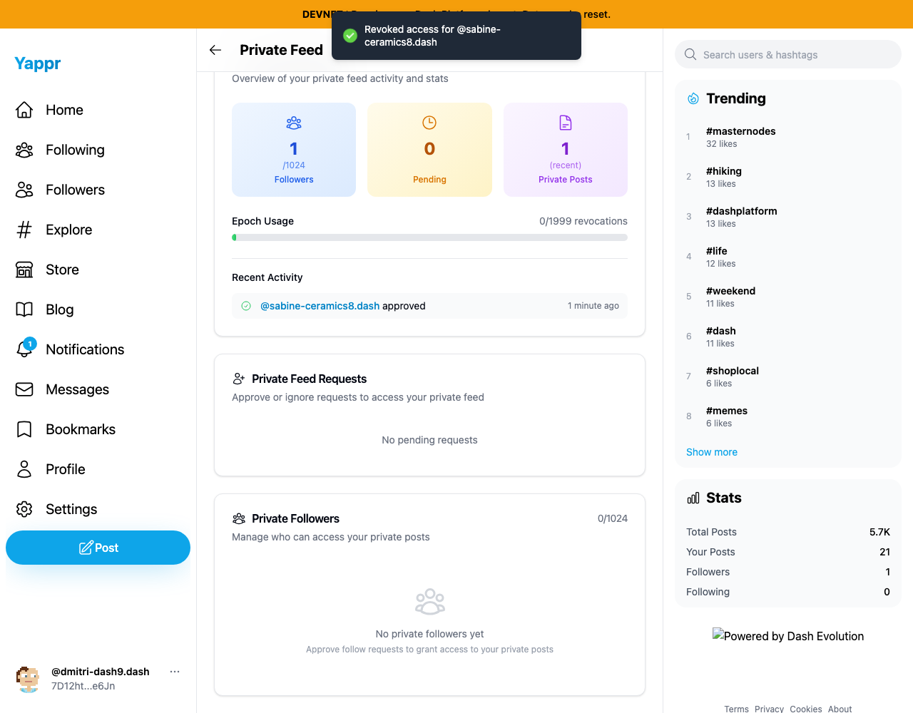
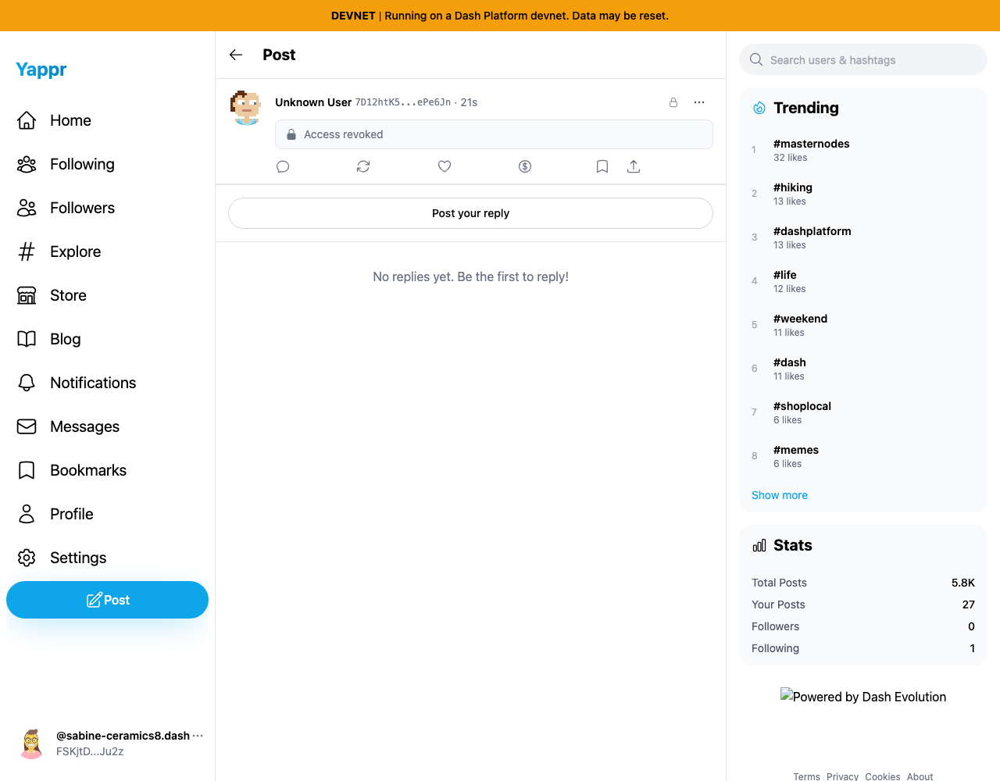

# Private-feed normal workflow QA — personas36/37

The normal enable → private post → request → approve → fresh recipient recovery/read → revoke → new private post workflow completed on exact staging `4105c5d1c914f5d0838619da93c3b8d28b4a780e`, independently built at `http://127.0.0.1:3211/devnet/`, live devnet. This is a feature test, not a cryptographic or access-control audit.

Owner36: `7D12htK5tT9cVbEEJwGS3PAnAZyoF11vW1fXjGePe6Jn` (`dmitri-dash9`, Dmitri Torres). Recipient37: `FSKjtD7izsATQWr6fZSgbJPxiJM3MZNTLGAj1SvtJu2z` (`sabine-ceramics8`, Sabine Yilmaz). Provisioned authentication and registered encryption keys were read only inside the harness; no key values or filled secret inputs were logged/captured. Browser session restoration is programmatic; subsequent actions use real application UI and network state.

| Story | Result | Evidence |
|---|---|---|
| Enable private feed with existing registered encryption key | PASS; feed-state document `BJmHrMZJ29mf5TNB3qxZcPvH4hPFbWv2bdpSAZjckg79` | [enable-before.png](enable-before.png), [enable-after.png](enable-after.png), after-enable.json |
| Load enabled feed in new owner session; enter registered key through normal dialog | PASS | [owner-fresh-setup.png](owner-fresh-setup.png), cycle-browser.json |
| Publish private-only post and owner readback | PASS; epoch1 post `GKGz8rFrbdp72TwUhfQDrUtbz5huwEP6VJ6T2D7jXAmN` | [private-compose.png](private-compose.png), [owner-private-readback.png](owner-private-readback.png), after-post.json |
| Follow owner and request private access | PASS; request `2xeknUsr69VutysSr56pu6N1VPvyNMoTF2NJ8c2ehw9j` | [request-pending.png](request-pending.png), after-request.json |
| Owner approves request | PASS; grant `E2FgUTBnBsmE9en1otdLrJwXLeVDLA68q9pTEVYreUks` | [owner-pending-request.png](owner-pending-request.png), [owner-approved.png](owner-approved.png), after-approve.json |
| Fresh approved recipient Recover → Save Key → read actual private text | PASS for reading; reply UI remains stale (below) | [follower-private-readback.png](follower-private-readback.png), cycle-browser.json |
| Owner revokes through Revoke → Confirm | PASS; grant and request absent, rekey `7NTpQdUKbbz79u7xuA6d3rWukvWgGaz2FJH5cmch8MBw`, epoch2 | [revoke-confirm.png](revoke-confirm.png), [owner-revoked.png](owner-revoked.png), after-revoke.json |
| Owner publishes another private post after revocation | PASS; epoch2 post `BqYTdPePdeknt4oA2T2P8mmDLZxTzrdf5UzUv7uRsxhq` | [owner-future-post.png](owner-future-post.png), after-future-post.json |
| Former recipient navigates to new private post using retained previously authorized session | PASS for ordinary UI: Access revoked, new text absent; reply UI remains stale (below) | [recipient-future-locked.png](recipient-future-locked.png), revoke-browser.json |
| Fresh recipient profile state and follow cleanup | PASS; Request Access offered, follow restored absent, grant/request absent | [recipient-profile-after-revoke.png](recipient-profile-after-revoke.png), final.json |

Observed UI issues requiring independent reproduction before fixing:

1. After Enable accepts the registered key, the same page says **Key not entered for this session**. The user must enter it again through **Enter Encryption Key**. `[enable-after.png](enable-after.png)` shows the inconsistency; the normal key-entry path then worked.
2. After fresh recipient recovery, actual decrypted text is shown while the reply area still says **Can't reply - no access to this private feed** (`[follower-private-readback.png](follower-private-readback.png)`). Conversely, after revocation the retained session sees **Access revoked** but still has **Post your reply** (`[recipient-future-locked.png](recipient-future-locked.png)`). No reply was attempted after revocation. The separate reply permission hook does not subscribe to key-state changes; another agent is independently reproducing this UI state issue.
3. Immediately after revocation, the private follower list says **0/1024** and **No private followers yet**, but the dashboard above still says **1** follower and **0/1999 revocations** (`[owner-revoked.png](owner-revoked.png)`). Independent persistence/reproduction remains needed; no claim is made that revocation failed.

All 14 authoritative screenshots in provenance.json were opened at original resolution. Two future-post screenshots include unresolved author display names while their public identity IDs and document readbacks identify the correct author. The normal feature result does not depend on those transient labels. Live seeding changed unrelated posts/global statistics. The failed first harness run used a feed-only composer selector on settings; it made no post/request/grant write and is retired as a harness error. Its local harness log and failure screenshot are intentionally omitted from this published package; do not treat that run as a product issue.

The private feed and two clearly labeled QA private posts remain; the grant, request, and ordinary follow were removed through the intended workflow. Personas36/37 are reserved for independent follow-up reproduction. Detailed time-ordered steps are in enable-browser.json, cycle-browser.json, and revoke-browser.json. Public SDK metadata is in initial.json through final.json. No secrets are present in this package.

## Observed UI states

After setup succeeds, the page immediately asks for the same encryption key again.

A fresh approved recipient recovered access and read the QA text, but the reply area still denies access.

After normal revocation the dashboard says one follower and zero revocations while its follower list says zero.

The former recipient's retained session correctly locks the new post, but its reply button remains visible. No reply action was attempted.

