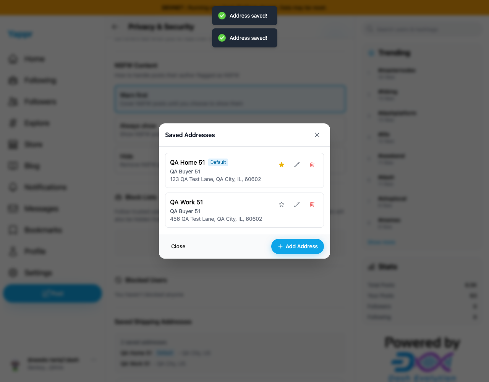
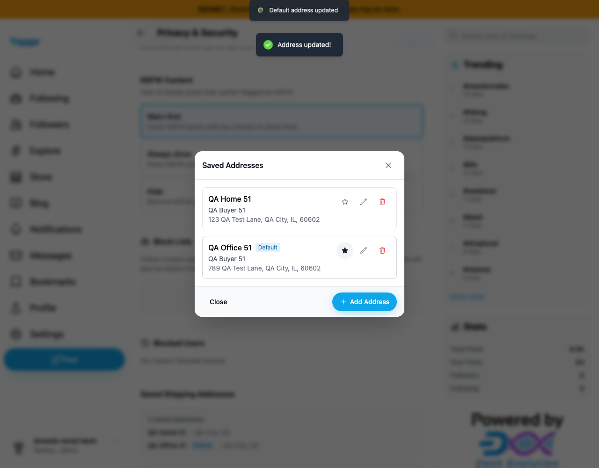

# Saved shipping addresses: create, edit, default, delete and persistence

Exact live baseline `4105c5d1c914f5d0838619da93c3b8d28b4a780e`, actual browser UI on devnet, persona51 identity `9enksyZPnWQUovGXXAQ879uJtBvbHTUY3ewJ5Tq5QNVe`. Auth session was restored from a dedicated seeded QA fixture; encryption key was restored through the actual Enter Key → Save Key UI. All addresses and contact details are synthetic.

Passed: empty required fields rejected; first address created as default; second address created; label/street edited; default changed; fresh reload decrypts saved edits/default; deletion cancelled without removal; default deletion persisted; independent SDK decryption confirmed remaining address. Later fixed-head regression tests deleted nondefault and last addresses in settings/checkout; independent SDK cleanup readback confirms an empty encrypted payload.

| Two addresses created | Second address edited |
|---|---|
|  |  |

Confirmed UI issues are documented separately: key-readiness refresh, visible default promotion after deletion, and missing form label associations. No Platform or GroveDB persistence/decryption defect was established.

`crud.json` retains a harness-only failure: after opening Delete Address it waited for role alertdialog, while the component uses role dialog. No delete was submitted at that point. `delete.json` records resumed normal-UI cancel/confirm actions and fresh readback. This selector correction was not counted as a product bug.

`sdk-readback.json` independently decrypts document `Fio3E9RNkP2Su23cXQfX5dvAc3MckewAgv8W7B3uqokz` at revision 5 after initial deletion. `sdk-cleanup.json` confirms zero addresses after final cleanup. Private keys remain outside this artifact. Included images were inspected at original resolution.
