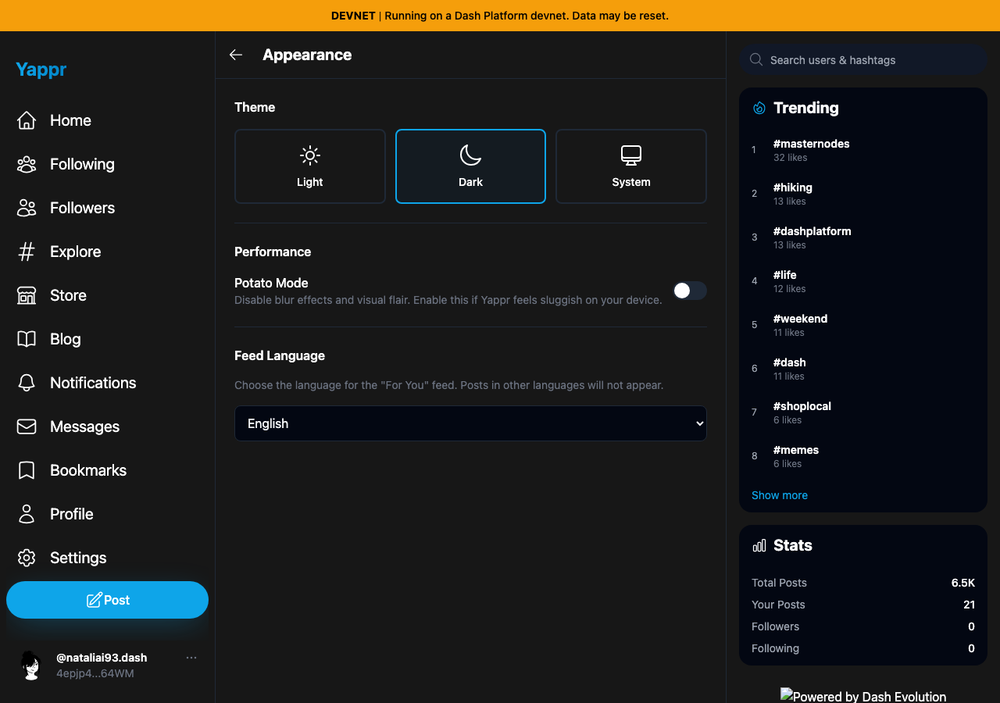
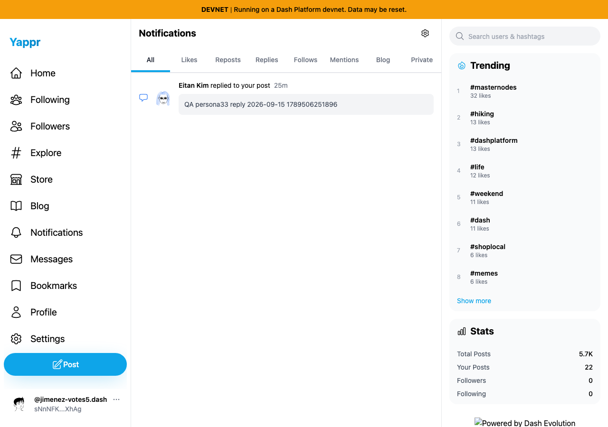
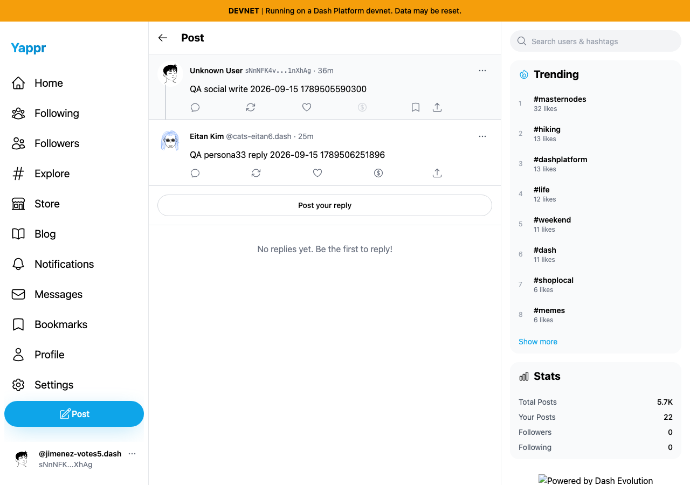

# Appearance and notification QA

Reference staging4105c5d1c914f5d0838619da93c3b8d28b4a780e, real devnet reads, production build at local/devnet. These are same-revision passing checks, not fix comparisons. Session restoration used privately loaded seeded fixtures. All three selected PNGs were opened at original resolution. Root-only branding is unavailable from the local base-only server, separately verified healthy on deployed staging.

Persona38: Light/Dark selection, Dark persistence on reload, System response to dark/light browser media changes passed. Screenshot shows settled Dark selection; JSON records assertions. A loading sidebar frame for System was not selected.

Persona30: actual persona33 reply notification appears; Replies filter includes it; Mark all as read survives reload; link opens persisted replyFm49xnhGoKheyBWKPn2KuzgeMwwuVDPgd61MRznovZg4. Read state is local to this browser, not a cross-device claim. The selected read-state capture is after reload, when the filter defaults back to All.

The destination exposes the separately confirmed unresolved parent-profile issue fixed by Yappr#422. Successful notification navigation does not certify that independent author-rendering behavior.
