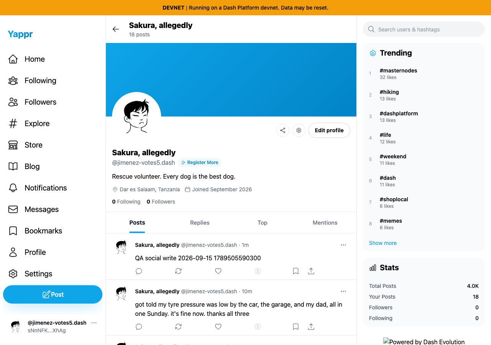
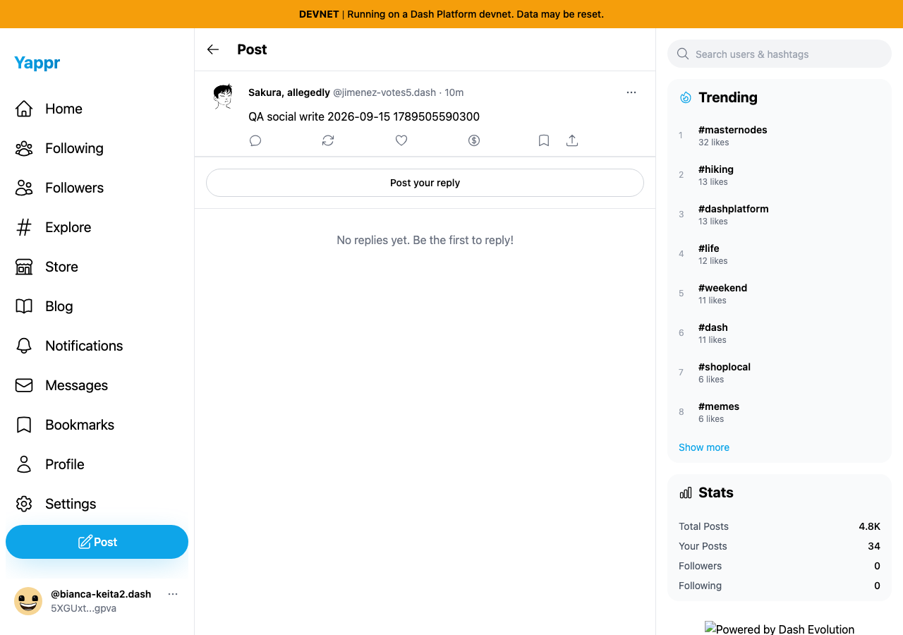
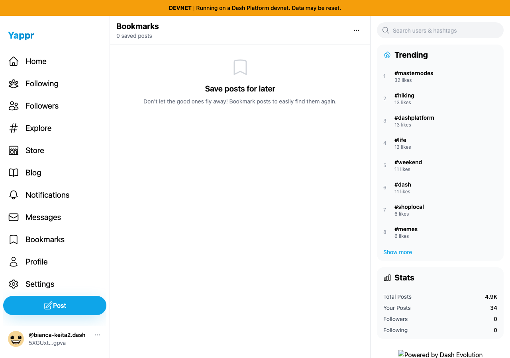

# Successful public post and engagement revalidation

Actual unchanged staging `4105c5d1c914f5d0838619da93c3b8d28b4a780e`, current live devnet, Chromium 1280×900. These are sequential QA states, not before/after product revisions or a proposed fix.

- Author: `sNnNFK4vrjhy6nPYpj2FSUhREY8CRG3QZscn61nXhAg` (seed persona30).
- Viewer: `5XGUxtqUKXN1bU5Wgu2XNFphzALUks1qTFmXW3AVgpva` (persona32).
- Real post: `9mcdDNznWP86bScjmMykF1kzNpecneoFoZVVNAB5qCFd`.
- Marker: `QA social write 2026-09-15 1789505590300`.

Steps: author opens the actual composer, enters the marker and submits. The success toast appears and the composer closes. An independent restored author session opens the profile and reads the saved post. Viewer opens the saved post, likes and bookmarks it. A new viewer browser context confirms the persisted like and finds the post in Bookmarks. Viewer then unlikes and removes the bookmark. A further fresh session confirms the unliked post after loading settles and the completed empty-bookmarks state.

| State | Actual application screenshot |
|---|---|
| Author fresh-session post readback |  |
| Viewer fresh-session like and bookmark readback |  |
| Viewer fresh-session unlike readback |  |
| Viewer fresh-session unbookmark readback |  |

All four final images were inspected at original resolution. Results record a corrected harness selector and rejected premature loading capture; neither was interpreted as a product failure. Only the final completed-state images above are authoritative. All mutations used the normal UI; no app DOM or Platform response was mocked. Programmatic session setup used current private fixture keys without logging or publishing them. Shared live post counts changed while other activity continued.

This establishes these successful mutation/readback cycles for the stated identities. It does not establish every insufficient-balance, offline, permission or key-type path. The post remains clearly labeled QA content for additional reply/repost tests.
