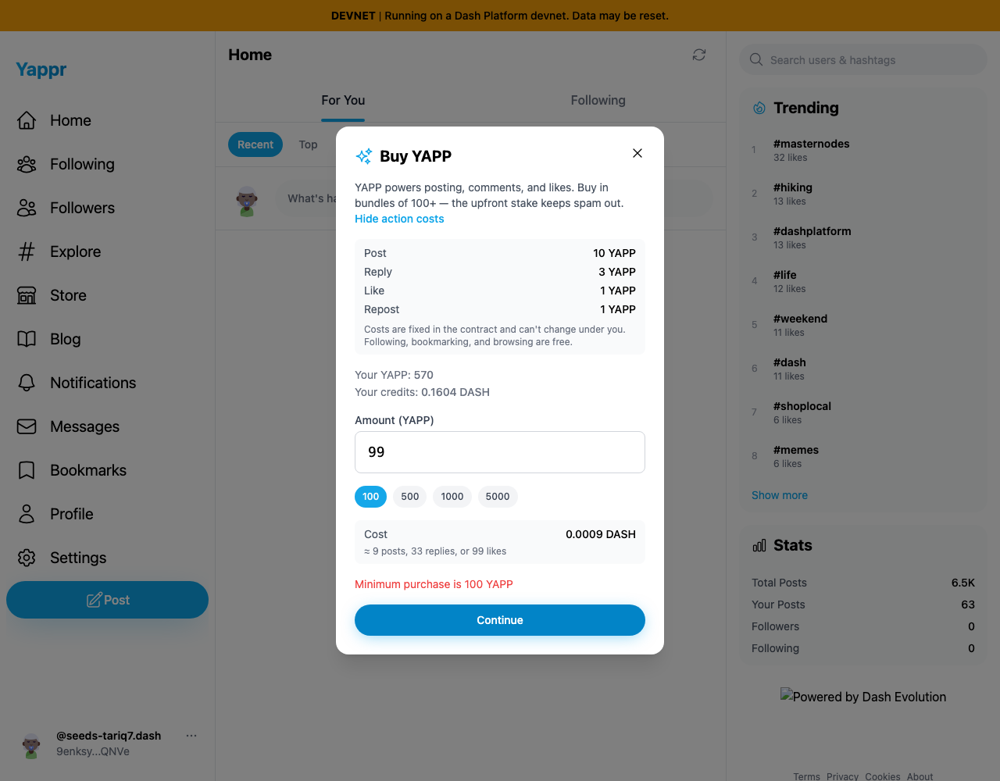
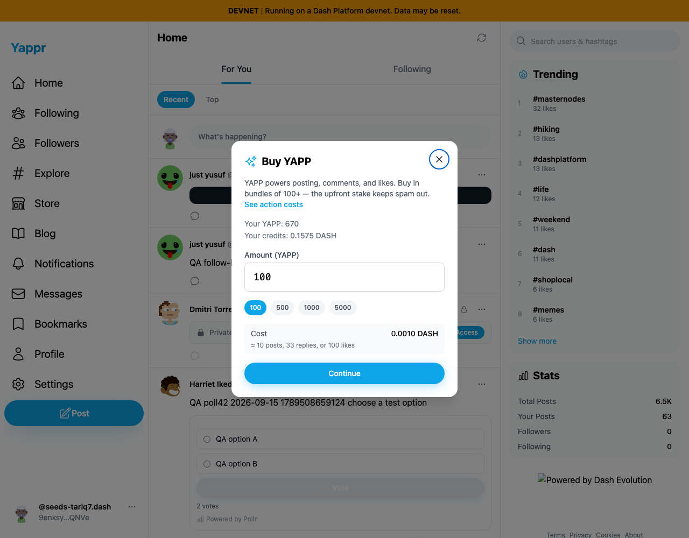
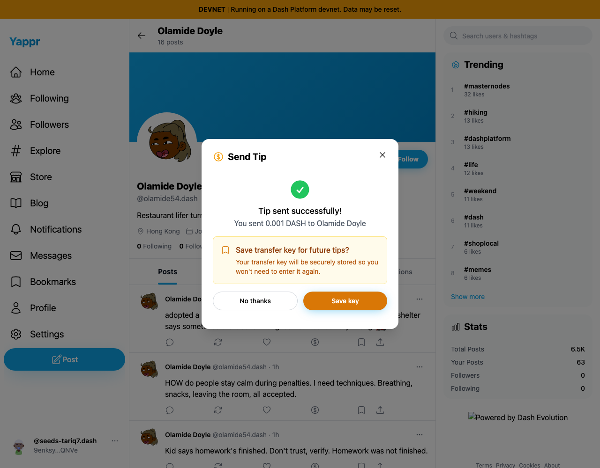
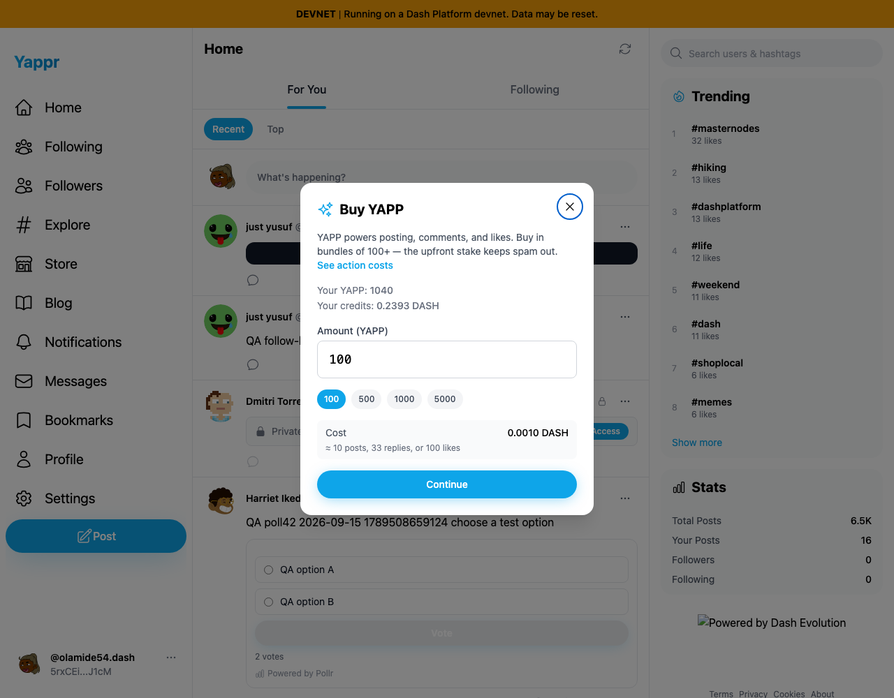

# Buy YAPP and tipping QA — 2026-09-15

Exact staging `4105c5d1c914f5d0838619da93c3b8d28b4a780e`, local `/devnet`, live Moutai. Browser fixture restores seeded persona51; all purchases/transfers use the actual modal buttons and separate real keys. This is functional QA evidence, not a fix comparison.

| Story | Result |
|---|---|
| View token action costs and reject a purchase below minimum | Passed:99YAPP rejected with minimum100 error. |
| Confirm and buy100YAPP | Passed: cost displayed0.0010DASH; HIGH login correctly required separate CRITICAL authorization. |
| Read token purchase independently | Passed: SDK570→670YAPP, fresh buyer UI670. |
| Reject tip below minimum | Passed:0.00001DASH rejected with minimum0.0010DASH. No transfer submitted. |
| Tip a user directly from their profile | Passed: single0.001devnetDASH credit transfer via actual UI, success prompt. |
| Read transfer independently | Passed: recipient23,826,917,680→23,926,917,680credits (+100,000,000, exactly0.001DASH), fresh recipient UI0.2393DASH. |

Sender51: `9enksyZPnWQUovGXXAQ879uJtBvbHTUY3ewJ5Tq5QNVe`; recipient52: `5rxCEiuGfwPkYFQ94mvxDaDG7W7dEdpU2zhq7aTLJ1cM` (Olamide Doyle).

## UI observations

Direct profile tips offer a Message field and display the note in confirmation, but the credit transfer has no memo and Yappr only creates a note for tips on posts. The actual transfer succeeded while the entered `Devnet QA tip51 to52` note was discarded. A separate fix hides this unsupported input for profile tips and explains how to send a public note via a post.

The immediate purchase success screen displayed the pre-purchase570 as “New balance” while its asynchronous balance refresh was still pending (`buy-success.png`). Independent SDK and fresh UI show670; this is a transient presentation concern, not lost tokens. The original capture did not measure how long that old value remained visible.

Tip input and confirmation images were recaptured after the successful transfer, with animation settled and no second transfer submitted; therefore sender balance reflects the completed purchase and tip. The transfer success image records the original actual action. No key-save action was taken. Secret inputs, key values and private session state are excluded. `before.json`, `after-purchase.json`, and `after-tip.json` preserve independent numeric readback; unrelated seeded posts are omitted.
