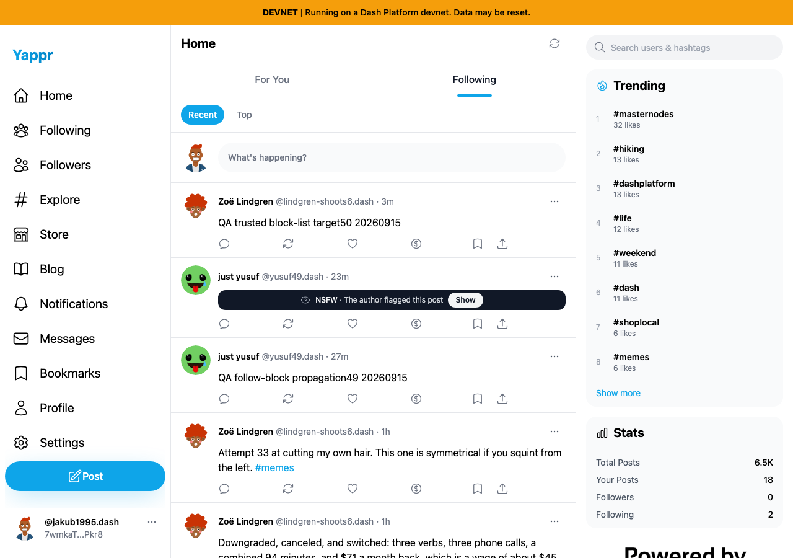
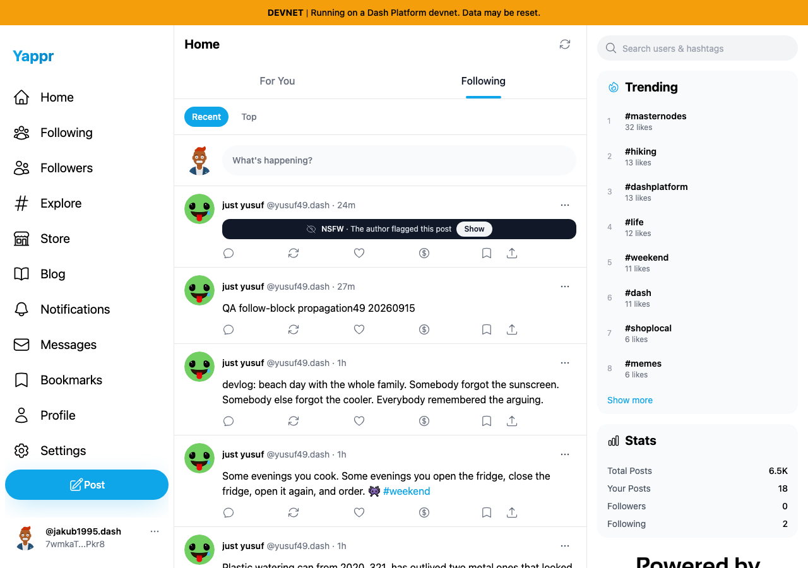
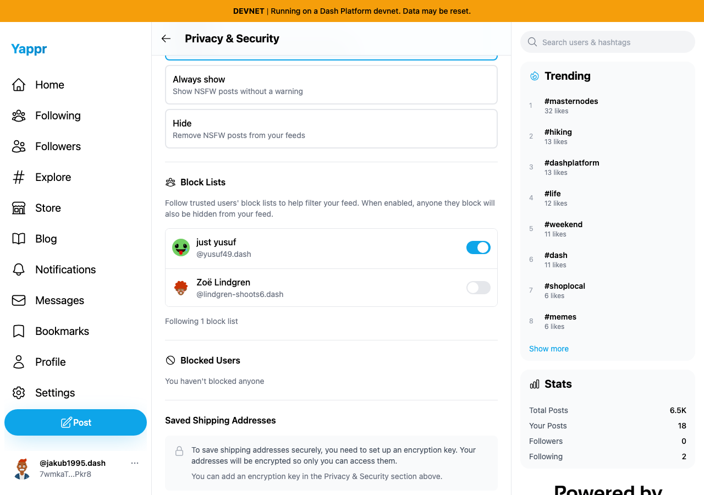

# Trusted block-list lifecycle: PASS

All observations use reference staging4105c5d1c914f5d0838619da93c3b8d28b4a780e and actual devnet data. This is a same-revision functional cycle, not a code-change comparison.

Persona49 blocks50. Persona48 follows49/50 and initially sees50. Persona48 enables49's block list; fresh settings readback preserves it; fresh Following excludes50 while retaining49. Disabling trust restores50. All temporary follows, trust and block relationships were removed. Test posts remain for review.

Target identity:GH2baAjjMokUyzj5KNQbzbsf4QnaPhRjtUPCqSBnQSLw. Target post:Bpewexqt3BpQVU2C1B8znUnkGT895m94KmE6gnKiUMJc. Block-list owner:4SFrGiHwDXKgcrDquF5wvFQ9oaWUGfqm8W4Wk4Qy6JBs.

| Before trust | After trust, fresh feed |
|---|---|
|  |  |

All three PNGs inspected at original resolution. Result stages and target IDs are included. Relative timestamps change during the cycle. No secret values captured. This functional pass separately exposed an unnamed-switch UI defect, fixed in its own PR.
