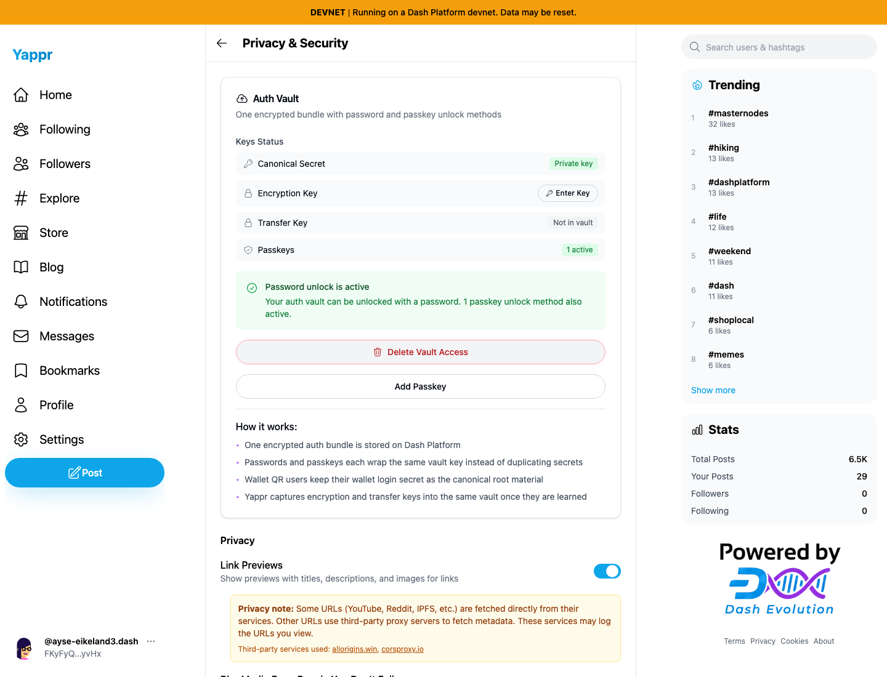
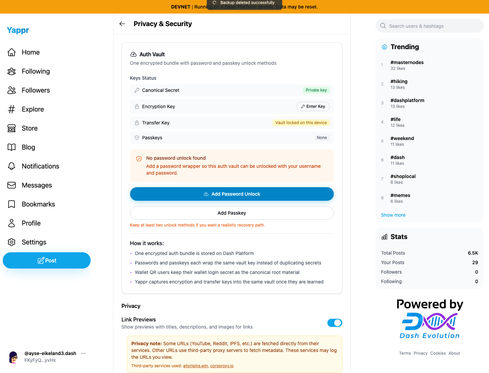
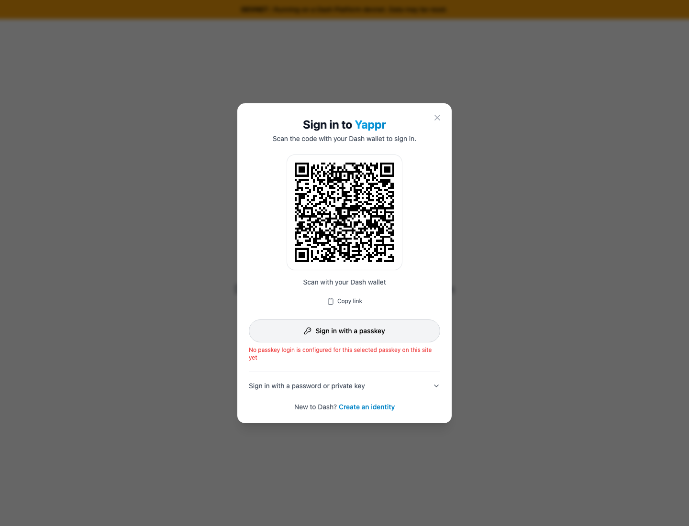
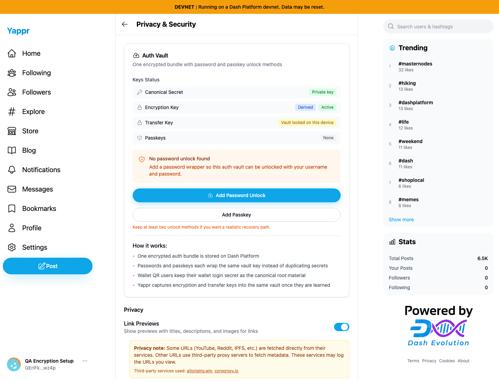

# Vault deletion and fresh encryption-key creation

Actual ordinary UI testing against the production export of staging `cf0efbc10b8757137063113ebbd2061e8b87d8f7`, using real devnet data and isolated Chromium sessions. No injected storage, SDK objects, DOM or network responses. Host SDK reads below independently verify public records. Documented fixture provisioning is separate from UI QA.

## Delete password and passkey access (S12)

Reserved persona69: `FKyFyQM9kb5dkWw12Vcjf8GwFT21GAVDN5MkT4bPyvHx`, ayse-eikeland3. Password enrollment and Chromium CTAP2 PRF virtual-passkey enrollment passed. Logout and passkey login then passed using the same live authenticator; no credential export/import was used. Physical passkey hardware was not tested.

The native confirmation says: “Are you sure you want to delete your on-chain key backup? You will need to use your private key to log in.” Cancelling left both methods active. Confirming removed the vault and both access documents; the retained passkey subsequently failed after logout with “No passkey login is configured for this selected passkey on this site yet.” Identity-specific lookup offered no password/passkey access, submission of the old password was disabled, and ordinary key fallback succeeded.

| Cancelled — both methods retained | Confirmed — both methods removed |
|---|---|
|  |  |

[Enrollment readback](enrolled69-readback.json) · [Deletion readback](deleted69-readback.json) · [Full S12 assertions](s12-results.json).

Persona68's password-only vault cancellation/deletion/key-fallback was also tested. An uncompressed authentication-WIF integration defect was isolated and fixed separately as [QA104 / PR501](https://github.com/PastaPastaPasta/yappr/pull/501), with its own exact-base/head comparison and same-vault readbacks. Compressed-WIF deletion succeeds on staging. Neither deletion claim implies invalidation of already-unlocked sessions, local/exported keys or historical ciphertext copies.

## Existing encryption-key mismatch feedback

Persona69 rejected persona68's encryption key with the following actual validation message. This focused screenshot excludes the populated credential field entirely. The dialog remained open; no matching key was stored by this negative test.

## New encryption-key creation

Dedicated identity `GEriFkuaUndk4zoBwCJ36Qn9Jy7NgjKsZbJauNdywz4p`, profile “QA Encryption Setup,” was provisioned with only keys0–3. [Public provisioning metadata](new-key/fixture.json) records funding/asset-lock references; no credentials are published. Normal key2 login, optional username skip and minimal profile creation reached Settings → Privacy & Security → Set Up.

- Continue was disabled until the backup acknowledgment. The ordinary Copy control saved the derived backup privately. Cancelling this step preserved the original four public keys.
- A different identity's MASTER key was rejected with the message below. This crop excludes the credential field. The fixture's own HIGH login key was also rejected: “Identity modifications require a MASTER key. You provided a HIGH key.”
- Correct MASTER authorization registered key4, purpose ENCRYPTION, security MEDIUM. Independent SDK readback matches the public key derived independently with HKDF-SHA256 from key2 using SHA256(identity ID) as salt and `yappr/encryption-key/v1` as info. Existing public keys0–3 were unchanged.
- A completely fresh browser context signed in with key2, skipped optional onboarding and automatically restored Derived / Active without entering the encryption key. No password vault exists on this new fixture.

| After ordinary registration | Independent fresh key-login session |
|---|---|
|  |  |

[Before keys](new-key/keys-before.json) · [After cancellation](new-key/keys-after-cancel.json) · [After creation](new-key/keys-after-create.json) · [UI assertions](new-key/results.json).

The ceremony also exposed an accessibility defect in the Master Key label and icon names; [QA118 / PR513](https://github.com/PastaPastaPasta/yappr/pull/513) contains the separate fix and exact comparison. Creation itself passed on the staging base. No general Platform/GroveDB write or deletion failure was reproduced with the proper signing-key encoding. All published original screenshots were inspected; populated secret fields and credential files are excluded.
